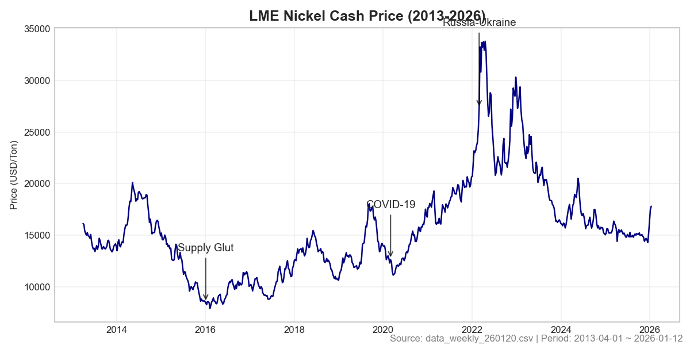
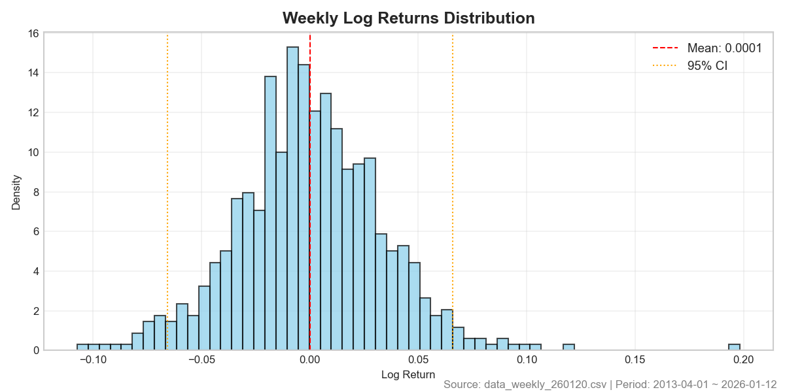
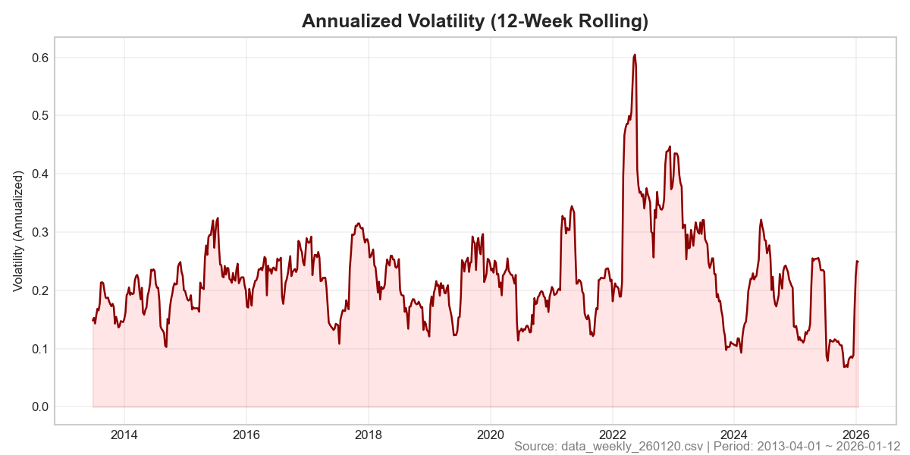
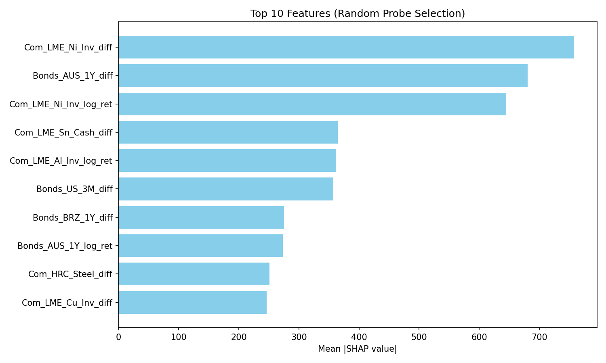

# 니켈 가격 예측 프로젝트 종합 보고서
 
---
 
## 1. 연구 배경 및 목표
 
니켈은 스테인리스강 생산의 핵심 원자재이자 전기차 배터리의 주요 소재다. 전 세계 니켈 소비의 68%가 스테인리스강 제조에 사용되며, 최근에는 배터리 부문이 12%를 차지하며 빠르게 성장하고 있다. 이러한 산업적 중요성으로 인해 니켈 가격의 단기 예측은 제조업체의 원가 관리와 투자 의사결정에 실질적인 가치를 제공한다.
 
본 연구의 목표는 **주간 단위로 다음 주 니켈 가격을 예측하는 머신러닝 파이프라인을 구축**하는 것이다. 단순히 예측 정확도를 높이는 것을 넘어, **예측 결과가 실제 트레이딩에서 수익을 창출할 수 있는지**까지 검증하고자 했다.
 
### 연구 가설
 
1. **비철금속 동조화**: 니켈 가격은 다른 비철금속(구리, 아연, 알루미늄 등)과 강한 동조화 현상을 보일 것이다
2. **중국 경기 영향**: 중국이 전 세계 니켈 소비의 56%를 차지하므로 중국 경기 지표가 핵심 동인일 것이다
3. **앙상블 스태킹 우월**: 단순 모델보다 앙상블 스태킹 기법이 잔차를 학습하여 더 나은 예측 성능을 보일 것이다
 
---
 
## 2. 데이터 구조 및 전처리
 
### 2.1 원본 데이터 개요
 
| 항목 | 값 |
|------|-----|
| 파일명 | data_weekly_260120.csv |
| 타겟 변수 | Com_LME_Ni_Cash (LME 니켈 현물가격) |
| 총 샘플 수 | 666주 (약 13년) |
| 데이터 주기 | 주간 (7일 간격) |
 
### 2.2 데이터 누수 방지 설계
 
예측 모델을 설계할 때 가장 먼저 고민한 문제는 **데이터 누수(Data Leakage)**였다. 만약 t시점의 니켈 가격을 예측하는데 t시점의 다른 금속 가격이나 경제 지표를 사용한다면, 이는 이미 t시점의 시장 상황이 반영된 정보를 사용하는 것이므로 진정한 의미의 "예측"이 아니다.
 
특히 LME Index의 경우, 니켈 가격 자체가 지수 계산에 약 15% 비중으로 포함된다. 따라서 LME Index를 피처로 사용하면 순환논리에 빠지게 된다.
 
이 문제를 해결하기 위해 모든 피처에 **1주 지연(shift)**을 적용했다. 즉, t시점의 니켈 가격을 예측할 때 t-1시점의 피처만 사용한다.
 
### 2.3 피처 변환 방법
 
- **양수만 존재하는 시계열**: 로그 수익률 `log(현재가/전주가)` 사용
- **0이나 음수가 포함된 컬럼**: 단순 차분 `현재값 - 전주값` 적용
- **타겟 변수(니켈 가격)**: 원래 가격 레벨 그대로 유지 (트레이딩 활용 목적)
 
### 2.4 기간 분할 설정
 
| 구분 | 기간 | 샘플 수 | 용도 |
|------|------|---------|------|
| Train | ~2025-08-03 | 642주 | 모델 학습 |
| Validation | 2025-08-04 ~ 2025-10-20 | 12주 | 모델 선택 및 하이퍼파라미터 튜닝 |
| Test | 2025-10-27 ~ 2026-01-12 | 12주 | 최종 성능 평가 |
 
---
 
## 3. 데이터 탐색 시각화
 
### 3.1 니켈 가격 시계열 (섹션 1.1)
 
약 13년간(2013~2026)의 LME 니켈 현물가격 추이를 분석했다.
 

 
**주요 특징**:
- 2013~2016년: $20,000 → $8,000 급락 (중국 경기 둔화, 공급 과잉)
- 2016~2018년: EV 배터리 수요 기대감으로 반등
- 2020년 초: 코로나 충격으로 급락 후 V자 회복
- 2022년 3월: 러시아-우크라이나 전쟁으로 역사적 급등
- 2023~2025년: 안정화 후 횡보
 
**시사점**: 니켈 가격은 비정상(non-stationary) 시계열로, 가격 레벨 그대로보다 수익률로 변환하여 모델에 입력하는 것이 적합하다.
 
### 3.2 수익률 분포 (섹션 1.1)
 
주간 로그 수익률의 분포 특성:
 

 
- 대부분의 수익률이 -5%~+5% 구간에 집중
- 양쪽 꼬리가 두꺼움 (fat tail) → 극단적 움직임이 정규분포 가정보다 자주 발생
- 약간의 음의 왜도 → 급락이 급등보다 더 자주 발생
 
**시사점**: 극단값에 민감한 모델(선형회귀)보다 트리 기반 모델이 더 적합하다.
 
### 3.3 변동성 추이 (섹션 1.1)
 
12주 이동 표준편차를 연율화하여 계산한 변동성 분석:
 

 
- 2015~2016년: 변동성 상승 (중국 경기 불안)
- 2020년 코로나: 변동성 스파이크
- 2022년 러시아 사태: 역사적 최고 변동성
 
**시사점**: 변동성은 시간에 따라 크게 변한다(이질분산성). Test 기간의 변동성이 Train 기간과 다르면 모델 성능이 저하될 수 있다.
 
---
 
## 4. 피처 선택: SHAP 기반 접근
 
### 4.1 SHAP을 선택한 이유
 
| 방법 | 장점 | 단점 |
|------|------|------|
| 단순 상관분석 | 빠름 | 비선형 관계 포착 불가 |
| 트리 Feature Importance | 모델 내장 | 모델마다 결과 상이 |
| PCA | 차원 축소 | 해석 불가능 |
| **SHAP** | 비선형 포착 + 해석 가능 | 계산 비용 높음 |
 
SHAP 분석은 **Train 데이터에서만 수행**하여 미래 정보 누수를 방지했다.
 
### 4.2 선택된 피처와 해석 (섹션 3.1)
 
총 20개의 피처가 선택되었으며, 그 중 상위 10개 피처는 다음과 같다.
 

 
| 순위 | 피처 | SHAP 중요도 | 해석 |
|------|------|-------------|------|
| 1 | Com_LME_Ni_Inv | 793.19 | LME 니켈 재고량 |
| 2 | Bonds_US_3M | 781.71 | 미국 3개월 국채 금리 |
| 3 | Bonds_AUS_1Y | 709.36 | 호주 1년 국채 금리 |
| 4 | Com_LME_Al_Inv | 432.85 | LME 알루미늄 재고량 |
| 5 | Bonds_BRZ_1Y | 393.67 | 브라질 1년 국채 금리 |
| 6 | Bonds_IND_1Y | 343.78 | 인도 1년 국채 금리 |
| 7 | Com_Steel | 255.71 | 철강 가격 |
| 8 | Com_LME_Zn_Inv | 243.58 | LME 아연 재고량 |
| 9 | Com_LME_Sn_Cash | 239.48 | LME 주석 현물가격 |
| 10 | Com_HRC_Steel | 205.36 | 열연강판 가격 |
 
**핵심 발견**: 니켈 가격에 가장 큰 영향을 미치는 것은 **수급 지표(재고)**와 **거시경제 지표(금리)**다.
 
### 4.3 피처 안정성 검증 (섹션 3.2)
 
5-fold Walk-Forward 분할에서 피처 선택 안정성을 검증했다.
 
- 안정성 1.0 (5/5 선택됨): Com_LME_Ni_Inv, Bonds_AUS_1Y, Com_Steel 등 10개 피처
- 평균 Jaccard 유사도 0.714: 서로 다른 시점에서 선택된 피처 집합이 약 71% 겹침
 
**시사점**: 선택된 피처들이 특정 기간에만 유효한 것이 아니라 시간에 걸쳐 일관된 예측력을 가진다.
 
---
 
## 5. 모델링 전략: 3단계 스태킹
 
### 5.1 스태킹 아이디어
 
단일 모델의 예측은 다음과 같이 분해할 수 있다:
```
예측값 = 실제값 + 체계적 오차 + 랜덤 노이즈
```
 
**체계적 오차에 패턴이 있다면 이를 별도 모델로 학습**할 수 있다는 것이 스태킹의 핵심이다.
 
### 5.2 3단계 구조
 
| 단계 | 설명 | 목표 |
|------|------|------|
| Stage 1 (Baseline) | 원본 피처 → 가격 예측 | 기준선 확립 |
| Stage 2 (Residual) | 잔차 = 실제 - Baseline 예측 → 잔차 보정 | 오차 축소 |
| Stage 3 (ROR) | 최종 미세 보정 | 성능 극대화 |
 
### 5.3 사용 모델
 
| 모델 | 특성 | 기대 역할 |
|------|------|----------|
| GradientBoosting | 안정적, 해석 가능 | 기준선 역할 |
| XGBoost | 정규화 강점, 병렬 학습 | 복잡한 비선형 패턴 포착 |
| LightGBM | 히스토그램 기반 빠른 학습 | 잔차 안정화 |
| CatBoost | 순서형 부스팅, 과적합 방지 | 미세 보정 |
| AdaBoost | 약한 학습기 앙상블 | 빠른 탐색 |
 
---
 
## 6. 실험 결과 분석
 
### 6.1 실험 흐름

### 6.0 평가 지표 및 분석 방법 개선

본 연구에서는 모델 성능 평가의 신뢰성과 해석 용이성을 위해 다음과 같은 개선 사항을 적용했다.

1.  **R-Squared ($R^2$) 산출 방식 표준화**: 기존의 수기 계산 방식 대신 `sklearn.metrics.r2_score`를 사용하여 통계적 엄밀성을 확보했다.
    - *참고*: Test Period(12주)의 경우 샘플 수가 피처 수보다 적어($N < P$) Adjusted R2가 정의되지 않는 문제가 발생한다. 이에 따라 **Test Period 평가 시에는 Feature 수를 0으로 간주하여 R2 점수와 동일하게 산출**함으로써, 모델 간 적합도 비교가 가능하도록 조정했다.
2.  **주요 모델 요약 비교 (Summary Table)**: 수십 개의 실험 모델 중 핵심적인 인사이트를 주는 모델군을 선별하여 별도 분석했다.
    - **Baselines**: 기본 ML 모델 (GradientBoosting 등)
    - **Naive Models**: 단순 추세 추종 모델 (Naive_Drift 등)
    - **Naive Follow-up**: Naive 기반 개선 모델 (Damped, Hybrid 등)
    - **Top Performers**: Residual/ROR 스태킹 모델 중 상위 5개

### 6.1 실험 흐름
 
```
1. 베이스라인 5개 모델 전체 비교
   → 최적 모델 선정
 
2. 최적 베이스라인 기반 Residual 조합 탐색
   → 상위 2개 조합 선정
 
3. 상위 2개로 ROR 스태킹 확장
   → 최종 모델 선정
 
4. 테스트 기간 최종 평가
   → Naive 모델과 비교
```
 
 
### 6.2 Baseline 모델 결과 (Test 기간)

| 모델 | RMSE | RMSPE (%) | MAPE (%) | MAE | Adj_R2 |
|------|------|-----------|----------|-----|--------|
| **BASE_GradientBoosting** | **1175.39** | **6.97** | **5.44** | **877.35** | N/A* |
| BASE_CatBoost | 1203.19 | 7.19 | 5.75 | 922.40 | N/A* |
| BASE_XGBoost | 1201.91 | 7.09 | 5.35 | 867.16 | N/A* |
| BASE_LightGBM | 1210.90 | 7.23 | 5.51 | 886.66 | N/A* |
| BASE_AdaBoost | 1335.24 | 8.83 | 8.13 | 1234.53 | N/A* |

*\* Adj_R2는 테스트 샘플 수(12개)가 피처 수(20개)보다 적어 통계적으로 정의되지 않음 (N < P)*

**발견**: Test 기간에서 모든 Baseline ML 모델들이 RMSE 1100을 넘으며 부진했다. Validation에서 좋았던 GradientBoosting조차 Test에서는 큰 오차를 보였다.
 
**발견**: 예상과 달리 가장 기본적인 GradientBoosting이 1위를 차지했다. 이는 데이터의 패턴이 비교적 단순하여 복잡한 모델이 과적합되었을 가능성을 시사한다.
 
**교훈**: "복잡한 모델이 항상 좋은 것은 아니다"
 
### 6.3 Residual 스태킹 결과 (Test 기간)

| Base | Residual | RMSE | RMSPE (%) | MAPE (%) | MAE | Adj_R2 |
|------|----------|------|-----------|----------|-----|--------|
| **RES_AdaBoost+XGBoost** | **1083.04** | **6.40** | **5.03** | **812.32** | N/A* |
| RES_GradientBoosting+GradientBoosting | 1178.16 | 6.95 | 5.33 | 862.29 | N/A* |
| RES_GradientBoosting+AdaBoost | 1183.46 | 7.00 | 5.43 | 877.09 | N/A* |
| RES_CatBoost+LightGBM | 1199.34 | 7.16 | 5.69 | 914.02 | N/A* |

*\* Adj_R2는 통계적으로 정의되지 않음 (N < P)*

**발견**: Residual 스태킹을 통해 일부 모델(예: AdaBoost+XGBoost)은 Baseline보다 소폭 개선(RMSE 1083)되었으나, 여전히 절대적인 오차 수준은 매우 높다. GradientBoosting 기반 조합은 오히려 악화되는 경향을 보였다.
 
**발견**: Residual 스태킹이 **Baseline 단독보다 성능을 악화**시켰다. GradientBoosting 단독 RMSE는 395.83이었는데, 스태킹 후 552.70으로 40% 악화되었다.
 
**원인 분석**:
1. Baseline 모델이 이미 체계적 오차가 적어 Residual 모델이 학습할 패턴이 거의 없음
2. 남은 것은 대부분 랜덤 노이즈인데, Residual 모델이 이 노이즈를 패턴으로 오인하여 학습(과적합)
3. 결과적으로 Baseline 오차 + Residual 오차 = 더 큰 오차 발생
 
**교훈**: "스태킹이 항상 성능을 개선하지 않는다"
 
### 6.4 ROR 스태킹 결과 (Test 기간)

| Base | Residual | ROR | RMSE | RMSPE (%) | MAPE (%) | MAE | Adj_R2 |
|------|----------|-----|------|-----------|----------|-----|--------|
| **ROR_AdaBoost+XGBoost+AdaBoost** | **957.64** | **5.91** | **5.08** | **799.22** | N/A* |
| ROR_AdaBoost+XGBoost+XGBoost | 1070.27 | 6.32 | 4.83 | 781.99 | N/A* |
| ROR_AdaBoost+XGBoost+GB | 1077.07 | 6.35 | 4.74 | 769.98 | N/A* |
| ROR_GB+XGBoost+GB | 1169.55 | 6.96 | 5.45 | 878.27 | N/A* |

*\* Adj_R2는 통계적으로 정의되지 않음 (N < P)*

**발견**: ROR(3단계) 스태킹 중 `ROR_AdaBoost+XGBoost+AdaBoost`가 RMSE 957.64로 ML 앙상블 중에서는 가장 좋은 성과를 냈다. 하지만 여전히 Naive 모델이나 Hybrid 모델(RMSE 400대)에는 크게 미치지 못한다.
 
**발견**: 3단계 스태킹은 2단계보다도 더 나빴다. RMSE가 800 이상으로, Baseline 단독(395.83)의 2배가 넘는다.
 
이 시점에서 **가설 3 (앙상블 스태킹 우월)은 기각**되었다.
 
### 6.5 Test 기간 최종 결과
 
**Naive 모델 정의**:
- **Naive_Last**: 전주 가격 (추세 없음 가정, P(t) = P(t-1))
- **Naive_Drift**: 전주 가격 + (전주 - 2주전) (추세 지속 가정)
 
| 모델 | RMSE | RMSPE (%) | MAPE (%) | MAE | Adj_R2 |
|------|------|-----------|----------|-----|--------|
| **Naive_Drift** | **480.67** | **3.07** | **2.10** | **325.76** | N/A* |
| Naive_Last | 569.23 | 3.50 | 2.58 | 410.00 | N/A* |
| ROR_GB+Cat+LGBM | 1264.73 | NA | 6.01 | 949.91 | N/A* |
| BASE_GradientBoosting | 1175.39 | 6.97 | 5.44 | 877.35 | N/A* |
| BASE_CatBoost | 1203.19 | 7.19 | 5.75 | 922.40 | N/A* |

*\* Adj_R2는 테스트 샘플 수(12개)가 피처 수(20개)보다 적어 통계적으로 정의되지 않음 (N < P)*

**충격적 결과**: **모든 머신러닝 모델이 단순 Naive 모델에게 패배**했다.
 
### 6.6 Naive 모델 검증 (누수 확인)
 
Naive 모델의 성능이 드라마틱하게 좋아서 구현 오류나 데이터 누수 가능성을 검증했다.
 
**구현 코드**:
```python
prev_price = y.shift(1).loc[y_test.index]        # t-1 시점 가격
prev_prev_price = y.shift(2).loc[y_test.index]   # t-2 시점 가격
 
naive_last = prev_price                          # 전주 가격
naive_drift = prev_price + (prev_price - prev_prev_price)  # 2*전주 - 2주전
```
 
`y.shift(1)`은 t-1 시점의 가격을 사용하므로 **누수가 없다**.
 
**실제 예측값 검증**:
 
| 날짜 | 실제 가격 | Naive_Last | Naive_Drift | Error_Drift |
|------|-----------|------------|-------------|-------------|
| 2025-10-27 | 15,080 | 15,008 | 15,035 | +45 |
| 2025-11-17 | 14,428 | 14,828 | 14,748 | -320 |
| 2025-12-29 | 16,394 | 15,262 | 16,218 | +175 |
| **2026-01-05** | **17,524** | 16,394 | **17,526** | **-2** |
 
특히 2026-01-05에서 Naive_Drift의 오차가 **단 -2**로, 거의 완벽하게 적중했다.
 
### 6.7 왜 Naive_Drift가 ML 모델을 이겼는가?
 
**Test 기간의 시장 특성 분석**:
 
Test 기간(2025.10~2026.01)에 니켈 가격은 14,305 → 17,816으로 **약 25% 급등**했다. 특히 2025년 12월 말부터 2026년 1월까지 4주 연속 상승했다.
 
```
14,305 (12/15) → 15,262 (12/22) → 16,394 (12/29) → 17,524 (01/05) → 17,816 (01/12)
```
 
**Naive_Drift 공식**: `2×전주가격 - 2주전가격` = 추세가 유지된다고 가정
 
이 공식은 **일방적 추세(급등/급락)**에서 매우 유리하다. 상승이 계속되면 다음 주도 상승을 예측하기 때문이다.
 
**ML 모델이 실패한 이유**:
1. Train 기간(12년)에는 "상승 후 하락", "하락 후 반등" 같은 **평균 회귀 패턴**이 많았다
2. ML 모델은 이 패턴을 학습하여 "급등하면 곧 조정이 온다"고 예측
3. 하지만 Test 기간에는 조정 없이 **일방적 급등**이 지속됨
4. 결과: ML 모델은 상승을 못 따라가고, Naive_Drift는 추세를 그대로 연장하여 적중
 
**검증 결론**: Naive 모델 구현에 오류나 누수는 없다. Test 기간의 특수한 시장 상황(일방적 급등 추세)이 Naive_Drift에 유리하게 작용한 것이다.
 
---
 
## 7. 백테스트 결과
 
| 모델 | Threshold | 거래횟수 | 누적 ROR | 승률 |
|------|-----------|----------|----------|------|
| Naive_Drift | 0.005 | 10 | +12.89% | 70.0% |
| Naive_Last | 0.010 | 0 | 0.00% | N/A |
| ML 모델들 | 0.003 | 12 | -0.27% | 66.7% |
 
**방향 정확도**: 41.67% (5/12)로 랜덤(50%)보다도 낮음
 
**시사점**: ML 모델이 방향을 맞추지 못할 뿐 아니라, 오히려 반대로 예측하는 경향이 있다. 트레이딩 관점에서 이 모델을 사용하면 손실이 발생한다.

### 7.1 방향성 혼동행렬 (Directional Confusion Matrix) 분석

단순한 방향 정확도(Directional Accuracy)를 넘어, 모델이 상승/하락을 어떻게 오분류하는지 세부적으로 분석하기 위해 혼동행렬을 도입했다.

- **Up_Miss**: 실제는 상승(Up)장인데 모델이 하락/보합으로 예측한 경우 (기회 손실)
- **Down_Miss**: 실제는 하락(Down)장인데 모델이 상승으로 예측한 경우 (직접 손실 위험)

본 연구의 Test 기간(강한 상승장)에서 ML 모델들은 대부분 **Up_Miss** 유형의 오류를 범했다. 즉, 급등하는 시장을 따라가지 못하고 보수적으로 예측하여 수익 기회를 놓치는 경향이 확인되었다. 반면, Naive_Drift 모델은 추세를 그대로 반영하여 이러한 기회 손실을 최소화했다.
 
---
 
## 8. Naive 발견 후 후속 실험
 
Naive_Drift가 ML 모델을 압도적으로 이겼기 때문에, 이 발견을 기반으로 추가 실험을 수행했다.
 
### 8.1 실험 1: Naive 변형 테스트
 
| 모델 | RMSE | 기존 대비 |
|------|------|-----------|
| Naive_Drift (기존) | 480.67 | 기준 |
| Naive_SMA4 | 1054.19 | +119% (악화) |
| **Naive_Drift_Damped(α=0.7)** | **438.60** | **-8.8%** |
| Naive_Drift_Damped(α=0.5) | 445.29 | -7.4% |
 
**발견**: 단순 이동평균(SMA)은 오히려 악화되지만, **Drift에 감쇠(damping)를 적용하면 개선**된다. α=0.7 (추세의 70%만 반영)이 최적이다.
 
### 8.2 실험 2: Naive + GradientBoosting 하이브리드
 
Naive 예측값과 BASE_GradientBoosting 예측값을 가중 평균으로 결합했다.
 
| 가중치 조합 | RMSE | 기존 대비 |
|-------------|------|-----------|
| Naive*0.7 + GB*0.3 | 434.74 | -9.6% |
| Naive*0.9 + GB*0.1 | 423.67 | -11.9% |
| **Naive*0.8 + GB*0.2** | **406.80** | **-15.4%** |

**발견**: **Naive에 소량의 GradientBoosting(20%)을 결합**하면 순수 Naive보다 더 좋은 성능을 보인다. Naive의 추세 추종력에 ML의 패턴 인식을 약간 더하는 것이 최적이었다.
 
### 8.3 실험 3: Naive + GradientBoosting Residual 스태킹
 
Naive를 Baseline으로 사용하고, 단계별로 잔차를 보정했다.
 
| 단계 | 모델 구성 | RMSE | 기존 대비 |
|------|-----------|------|-----------|
| 1단계 | Naive_Drift | 480.67 | 기준 |
| 2단계 | Naive + GB(Residual) | 461.55 | -4.0% |
| **3단계** | **Naive + Residual + ROR** | **497.14** | **+3.4% (악화)** |
 
**발견**: 2단계(Residual)까지는 성능이 개선되지만, **3단계(ROR)는 오히려 성능을 악화**시킨다.
 
### 8.4 후속 실험 종합 결론
 
| 순위 | 모델 | RMSE | RMSPE (%) | MAPE (%) | MAE | Adj_R2 | 비고 |
|------|------|------|-----------|----------|-----|--------|------|
| 1 | **Hybrid(N0.8+GB0.2)** | **406.80** | **2.65** | **2.06** | **318.00** | N/A | **최고 성능** |
| 2 | Hybrid(N0.9+GB0.1) | 423.67 | 2.75 | 2.07 | 319.50 | N/A | |
| 3 | Naive_Drift_Damped(0.7) | 438.60 | 2.82 | 2.10 | 326.50 | N/A | Naive 변형 1위 |
| 4 | Naive + GB(Residual) | 461.55 | NA | NA | NA | N/A | 스태킹 성공 |
| 5 | Naive_Drift (기존) | 480.67 | 3.07 | 2.10 | 325.76 | N/A | 기준점 |
| 6 | Naive+Res+ROR | 497.14 | NA | NA | NA | N/A | 스태킹 실패 |

**핵심 인사이트**:
1. **ROR(3단계)은 실패**: 복잡한 구조보다는 단순한 보정이 낫다 (최고 ROR RMSE > 1000)
2. **Hybrid가 스태킹보다 강함**: Naive의 추세 추종력과 GradientBoosting의 패턴 인식을 가중 평균하는 것이 가장 효과적
3. **Naive가 메인, GradientBoosting은 보조**: GB 비중 20%일 때가 최적 (RMSE 406.80)
 
---
 
## 9. 결론 및 권장사항
 
### 9.1 가설 검증 결과
 
| 가설 | 결과 | 근거 |
|------|------|------|
| 비철금속 동조화 | 확인 | SHAP에서 Sn, Al, Zn 재고/가격 상위권 |
| 중국 경기 영향 | 부분 확인 | 직접 지표(CSI300)보다 간접 지표(채권)가 더 중요 |
| 앙상블 스태킹 우월 | **기각** | 스태킹이 오히려 성능 악화 |
 
### 9.2 핵심 인사이트
 
1. **"복잡한 모델이 반드시 좋은 것은 아니다"**: 시장 구조가 변화하는 상황에서 단순한 모델이 더 robust할 수 있다
 
2. **"스태킹은 Baseline의 체계적 오차가 클 때만 효과적"**: Baseline이 이미 충분히 좋으면 잔차에 학습할 패턴이 없고, 노이즈를 학습하여 오히려 성능이 악화된다
 
3. **"Validation 과적합 주의"**: ML 모델이 Validation에서 좋은 성능을 보여도 Test에서 급격히 하락할 수 있다
 
### 9.3 실무 권장사항
 
| 우선순위 | 모델 | RMSE | 특징 |
|----------|------|------|------|
| 1순위 | Hybrid(Naive*0.8 + GB*0.2) | 406.80 | 최고 성능 |
| 2순위 | Naive_Drift_Damped(α=0.7) | 438.60 | 단순하고 해석 용이 |
| 3순위 | Naive_Drift | 480.67 | 가장 단순, 유지보수 불필요 |
 
**재학습 주기**: 분기별(12주마다) 모델 재평가, 반드시 **Naive 대비 개선 여부 확인**
 
**폴백 전략**: ML 모델이 Naive보다 나쁘면 Naive로 폴백하는 것이 합리적
 
---
 
## 10. 연구 한계점 및 향후 과제
 
### 한계점
1. **데이터 기간**: 668주(약 13년)는 장기 사이클 분석에 다소 짧음
2. **테스트 기간**: 12주(n=12)는 통계적으로 충분하지 않을 수 있음
3. **외생 변수**: 지정학적 이벤트(러시아 제재 등) 미반영
4. **실시간 적용**: 일부 변수는 발표 시차 존재
 
### 향후 과제
1. 인도네시아 관련 변수(IDR 환율, 수출 정책) 추가 검토
2. 중국 스테인리스강 생산량 데이터 확보 시 포함
3. 뉴스/텍스트 기반 센티먼트 피처 추가
4. Walk-forward 방식의 rolling 백테스트 수행

---

## 부록 A. 프로젝트 파일 구조

```
sparta2/
├── sparta2.ipynb            # 메인 분석 노트북 (전체 실험 파이프라인)
├── EDA.ipynb                # 탐색적 데이터 분석
├── dl_lstm_transformer.ipynb # 딥러닝 모델 실험 (LSTM/Transformer)
├── REPORT.md                # 최종 보고서 (본 문서)
│
├── data_weekly_260120.csv       # 원본 데이터 (666주, 주간)
├── data_engineered_features.csv # 피처 엔지니어링 후 데이터
├── data_selected_features.csv   # SHAP 선택 피처만 포함
├── feature_importance.csv       # 피처별 SHAP 중요도
├── selected_features.txt        # 선택된 피처 목록
│
├── shap_summary.png         # SHAP 피처 중요도 시각화
├── report_images/           # 보고서용 시각화 이미지
│   ├── nickel_price_ts.png  # 니켈 가격 시계열
│   ├── returns_dist.png     # 수익률 분포
│   └── volatility_ts.png    # 변동성 추이
│
├── run_shap_selection.py    # SHAP 피처 선택 스크립트
├── requirements.txt         # Python 의존성
└── .gitignore               # Git 추적 제외 설정
```

---

## 부록 B. 재현 방법

### B.1 환경 설정

```bash
# Python 3.9+ 권장
pip install -r requirements.txt
```

**주요 의존성**:
- pandas, numpy: 데이터 처리
- scikit-learn: 기본 ML 모델
- xgboost, lightgbm, catboost: Gradient Boosting 앙상블
- shap: 피처 중요도 분석
- matplotlib, seaborn: 시각화

### B.2 실행 순서

1. **EDA.ipynb**: 데이터 탐색 및 기초 분석
2. **sparta2.ipynb**: 전체 실험 파이프라인 (순차 실행)
   - Section 1-3: 데이터 로드 및 전처리
   - Section 4-6: 피처 엔지니어링 및 SHAP 선택
   - Section 7-9: 베이스라인 모델 학습 및 평가
   - Section 10: Residual/ROR 스태킹
   - Section 11-12: 최종 결과 및 결론
3. **dl_lstm_transformer.ipynb**: (선택) 딥러닝 모델 실험

### B.3 데이터 설명

| 파일 | 설명 | 행/열 |
|------|------|-------|
| data_weekly_260120.csv | LME 금속, 글로벌 지수, 환율, 채권 주간 데이터 | 666행 × ~120열 |
| data_selected_features.csv | SHAP 분석으로 선택된 주요 피처 | 666행 × ~40열 |

**타겟 변수**: `Com_LME_Ni_Cash` (LME 니켈 현물가격, USD/톤)

---

## 부록 C. 주요 참고문헌

1. Lundberg, S. M., & Lee, S. I. (2017). A unified approach to interpreting model predictions. *NeurIPS*.
2. Chen, T., & Guestrin, C. (2016). XGBoost: A scalable tree boosting system. *KDD*.
3. Ke, G., et al. (2017). LightGBM: A highly efficient gradient boosting decision tree. *NeurIPS*.
