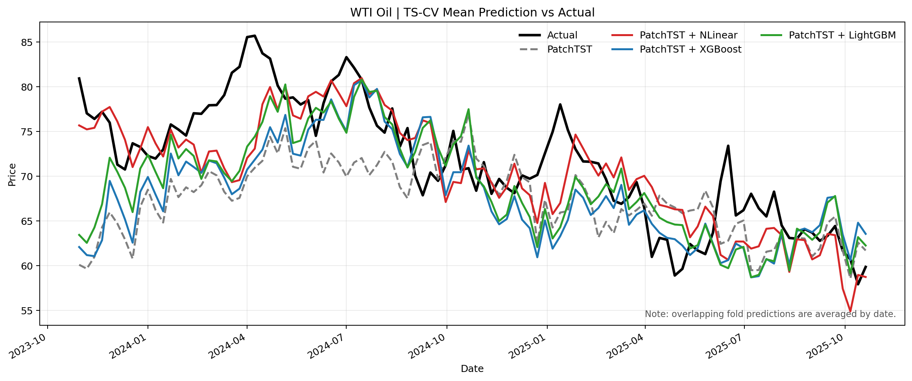
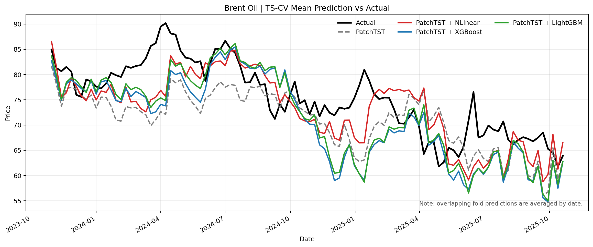
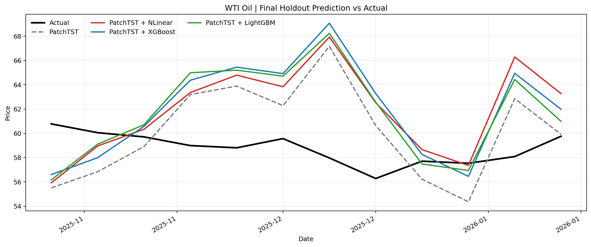
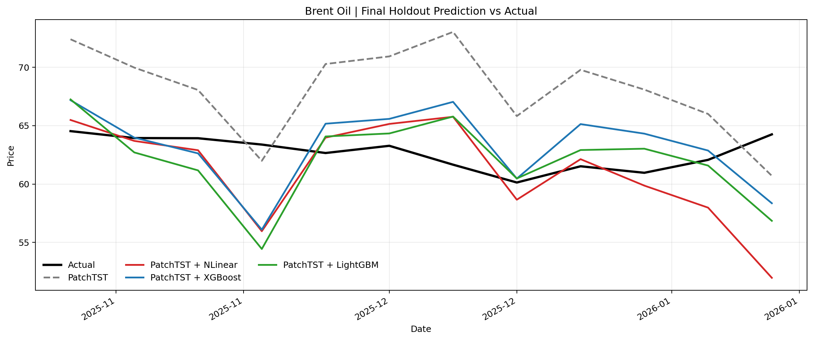

# PatchTST + Exogenous Residual Correction 결과보고서

본 문서는 [oil_patchtst_exog_residual_benchmark_0318.py](/Users/jaeholee/Desktop/T-LAB/sparta_2/sparta2/oil_patchtst_exog_residual_benchmark_0318.py) 기준의 교수님 보고용 리포트 초안이다.  
이번 버전은 **다변량 + 외생변수 + lagged exogenous feature** 설정을 사용했고, 기존 [oil_patchtst_nlinear_lgbm.py](/Users/jaeholee/Desktop/T-LAB/sparta_2/sparta2/oil_patchtst_nlinear_lgbm.py)의 feature engineering 아이디어를 유지하면서 `PatchTST baseline + NLinear/XGBoost/LightGBM residual correction`을 `WTI Oil`, `Brent Oil` 모두에 확장했다.

# 01. 핵심쟁점

---

- `기본모델(Bench-mark)`인 `PatchTST + lagged exogenous features`와 `실험모델(PatchTST + Residual Correction)`을 비교했을 때, **성능 향상이 있는지**
- `NLinear`, `XGBoost`, `LightGBM` 중 **어떤 residual model이 다변량·외생변수 설정에서 가장 일관된 개선을 보이는지**
- 단일 holdout뿐 아니라, **expanding-window ts-cv에서도 residual correction의 효과가 재현되는지**

# 02. 데이터 및 모델 세팅

---

- **예측 타깃:**
  - `WTI Oil`의 현물 가격 (`Com_CrudeOil`)
  - `Brent Oil`의 현물 가격 (`Com_BrentCrudeOil`)
- **예측 단위:**
  - 주간 예측
- **전체 데이터 구간:**
  - `2013-04-01 ~ 2026-01-12` (총 `668주`)
- **평가 프로토콜 공통 설정:**
  - `input size = 48`
  - `window size = 12`
  - `step size = 4`
  - `number of windows = 24`
  - `final holdout = 12`
  - `season length = 52`
  - 따라서 최근 `116주`가 실질 평가영역이며, `52 x 2 + 12 = 116`으로 계산됨

- **데이터 구간 세팅:**
  - TrainSet 기간: `2013-04-01 ~ 2023-10-23` (총 `552주`, 첫 번째 ts-cv fold의 초기 학습구간)
  - ValidationSet 기간: `2023-10-30 ~ 2025-10-20` (총 `24개 Fold`, expanding window ts-cv)
    - Cross-Validation Fold 1: `2023-10-30 ~ 2024-01-15` (총 `12주`)
    - Cross-Validation Fold 2: `2023-11-27 ~ 2024-02-12` (총 `12주`)
    - Cross-Validation Fold 3: `2023-12-25 ~ 2024-03-11` (총 `12주`)
    - Cross-Validation Fold 4: `2024-01-22 ~ 2024-04-08` (총 `12주`)
    - Cross-Validation Fold 5: `2024-02-19 ~ 2024-05-06` (총 `12주`)
    - Cross-Validation Fold 6: `2024-03-18 ~ 2024-06-03` (총 `12주`)
    - Cross-Validation Fold 7: `2024-04-15 ~ 2024-07-01` (총 `12주`)
    - Cross-Validation Fold 8: `2024-05-13 ~ 2024-07-29` (총 `12주`)
    - Cross-Validation Fold 9: `2024-06-10 ~ 2024-08-26` (총 `12주`)
    - Cross-Validation Fold 10: `2024-07-08 ~ 2024-09-23` (총 `12주`)
    - Cross-Validation Fold 11: `2024-08-05 ~ 2024-10-21` (총 `12주`)
    - Cross-Validation Fold 12: `2024-09-02 ~ 2024-11-18` (총 `12주`)
    - Cross-Validation Fold 13: `2024-09-30 ~ 2024-12-16` (총 `12주`)
    - Cross-Validation Fold 14: `2024-10-28 ~ 2025-01-13` (총 `12주`)
    - Cross-Validation Fold 15: `2024-11-25 ~ 2025-02-10` (총 `12주`)
    - Cross-Validation Fold 16: `2024-12-23 ~ 2025-03-10` (총 `12주`)
    - Cross-Validation Fold 17: `2025-01-20 ~ 2025-04-07` (총 `12주`)
    - Cross-Validation Fold 18: `2025-02-17 ~ 2025-05-05` (총 `12주`)
    - Cross-Validation Fold 19: `2025-03-17 ~ 2025-06-02` (총 `12주`)
    - Cross-Validation Fold 20: `2025-04-14 ~ 2025-06-30` (총 `12주`)
    - Cross-Validation Fold 21: `2025-05-12 ~ 2025-07-28` (총 `12주`)
    - Cross-Validation Fold 22: `2025-06-09 ~ 2025-08-25` (총 `12주`)
    - Cross-Validation Fold 23: `2025-07-07 ~ 2025-09-22` (총 `12주`)
    - Cross-Validation Fold 24: `2025-08-04 ~ 2025-10-20` (총 `12주`)
  - TestSet 기간: `2025-10-27 ~ 2026-01-12` (총 `12주`)

- **피처리스트**
  - 기본모델 및 실험모델 공통 외생변수 세트 (총 `59개`)
    - 원시 변수 `24개` + 파생 변수 `35개`
    - 모든 외생변수는 **lagged exogenous** 방식으로 `shift(1)` 처리하여 사용

    ```python
    # raw features (24)
    'Com_CrudeOil', 'Com_BrentCrudeOil',
    'Com_Gasoline', 'Com_NaturalGas', 'Com_Uranium', 'Com_Coal',
    'Com_LME_Cu_Cash', 'Com_Steel', 'Com_Iron_Ore',
    'Idx_DxyUSD', 'EX_USD_CNY',
    'Bonds_US_10Y', 'Bonds_US_2Y', 'Bonds_US_3M',
    'Idx_SnPVIX', 'Com_Gold',
    'Idx_SnP500', 'Idx_CSI300',
    'EX_USD_KRW', 'Bonds_KOR_10Y', 'EX_USD_JPY',
    'Com_Corn', 'Com_Soybeans', 'Com_PalmOil'
    ```

    ```python
    # derived features (35)
    '[each raw feature]_ret',
    'Spread_US_10Y_2Y', 'Spread_Crack', 'Ratio_Gold_Oil',
    'Com_Gasoline_ma4_ratio', 'Com_Gasoline_ma12_ratio',
    'Com_NaturalGas_ma4_ratio', 'Com_NaturalGas_ma12_ratio',
    'Idx_SnPVIX_ma4_ratio', 'Idx_SnPVIX_ma12_ratio',
    'Idx_DxyUSD_ma4_ratio', 'Idx_DxyUSD_ma12_ratio'
    ```

- **모델 세팅**
  - 기본모델 `PatchTST + lagged exogenous features`

    ```python
    patchtst_params = {
        "input_size": 48,
        "hidden_size": 128,
        "attention_heads": 16,
        "linear_hidden_size": 256,
        "patch_len": 16,
        "stride": 8,
        "dropout": 0.2,
        "encoder_layers": 3,
        "attn_dropout": 0.0,
        "fc_dropout": 0.2,
        "max_steps": 600,
        "learning_rate": 0.0001,
        "batch_size": 32,
        "patience": 20,
    }
    ```

  - 실험모델 `PatchTST + Residual Correction`

    ```python
    residual_models = {
        "NLinear": {
            "seq_len": 48,
            "max_steps": 400,
            "learning_rate": 0.001,
            "batch_size": 64,
            "patience": 20,
        },
        "XGBoost": {
            "n_estimators": 100,
            "learning_rate": 0.03,
            "max_depth": 4,
            "subsample": 0.8,
            "colsample_bytree": 0.8,
            "reg_alpha": 0.0,
            "reg_lambda": 1.0,
            "early_stopping_rounds": 20,
        },
        "LightGBM": {
            "n_estimators": 100,
            "learning_rate": 0.03,
            "num_leaves": 31,
            "max_depth": 4,
            "min_child_samples": 20,
            "subsample": 0.8,
            "colsample_bytree": 0.8,
            "reg_alpha": 0.0,
            "reg_lambda": 1.0,
            "early_stopping_rounds": 20,
        },
    }
    ```

# 03. 실험 설계 및 적용

---

- 본 실험은 기존 다변량·외생변수 파이프라인의 핵심인 **lagged exogenous feature engineering**을 유지했다.
- `PatchTST baseline`은 최근 `48주`의 lagged multivariate sequence를 입력으로 받고, 각 평가시점에 대해 one-step 방식으로 예측했다.
- residual correction은 `PatchTST`의 학습구간 residual history에 기반해 순차적으로 적용했다.
  - `NLinear`: residual sequence + latest exogenous vector
  - `XGBoost`: residual lag sequence + latest exogenous vector
  - `LightGBM`: residual lag sequence + latest exogenous vector
- 모든 비교는 동일한 `24개 ts-cv fold`와 동일한 `final holdout 12주`에서 수행했다.
- 모든 성능 비교 지표는 `RMSE`, `MAE`, `MAPE`, `NRMSE(max-min)` 기준으로 통일했다.
- 결과표는 `Target | Baseline Model | Residual Model | RMSE | MAE | MAPE | NRMSE` 형식으로 통일하고, residual model을 baseline 옆에 붙여 성능 차이를 직접 비교할 수 있게 구성했다.

# 04. 실험(모델링) 결과

### 04-01. 결과 요약 (MAPE 기준)

---

- 아래 요약표는 `ts-cv MAPE` 기준으로 baseline 대비 residual correction의 개선 여부를 정리한 표이다.
- 실제 수치는 [leaderboard_tscv.csv](/Users/jaeholee/Desktop/T-LAB/sparta_2/sparta2/output_oil_patchtst_exog_residual_0318/leaderboard_tscv.csv) 와 [leaderboard_holdout.csv](/Users/jaeholee/Desktop/T-LAB/sparta_2/sparta2/output_oil_patchtst_exog_residual_0318/leaderboard_holdout.csv) 기준으로 기입했다.

| Target | Baseline | Residual Model | Bench-mark MAPE (%) | 실험모델 MAPE (%) | 증감 (%p) |
| --- | --- | --- | --- | --- | --- |
| WTI Oil | PatchTST | NLinear | 9.789 | 6.126 | -3.663 |
| WTI Oil | PatchTST | LightGBM | 9.789 | 8.027 | -1.762 |
| WTI Oil | PatchTST | XGBoost | 9.789 | 8.591 | -1.198 |
| Brent Oil | PatchTST | NLinear | 8.921 | 6.837 | -2.084 |
| Brent Oil | PatchTST | LightGBM | 8.921 | 8.568 | -0.353 |
| Brent Oil | PatchTST | XGBoost | 8.921 | 8.984 | +0.063 |

- **핵심 Leaderboard (TS-CV)**
  - 발표용 메인 표는 아래 `ts-cv` 기준 leaderboard를 사용하는 것이 적절하다.
  - 다변량·외생변수 설정에서는 `WTI`, `Brent` 모두 `NLinear` residual correction이 평균적으로 가장 좋았다.

| Target | Baseline Model | Residual Model | RMSE | MAE | MAPE | NRMSE |
| --- | --- | --- | --- | --- | --- | --- |
| WTI Oil | PatchTST | `-` | 8.650 | 7.137 | 9.789 | 0.311 |
| WTI Oil | PatchTST | `NLinear` | **5.852** | **4.435** | **6.126** | **0.211** |
| WTI Oil | PatchTST | `LightGBM` | 7.357 | 5.824 | 8.027 | 0.265 |
| WTI Oil | PatchTST | `XGBoost` | 8.014 | 6.297 | 8.591 | 0.288 |
| Brent Oil | PatchTST | `-` | 8.761 | 6.828 | 8.921 | 0.308 |
| Brent Oil | PatchTST | `NLinear` | **6.687** | **5.153** | **6.837** | **0.235** |
| Brent Oil | PatchTST | `LightGBM` | 8.616 | 6.475 | 8.568 | 0.303 |
| Brent Oil | PatchTST | `XGBoost` | 9.112 | 6.820 | 8.984 | 0.321 |

### 04-02. 세부 결과

---

- **ts-cv Leaderboard**
  - ValidationSet 기간: `2023-10-30 ~ 2025-10-20` (총 `24개 Fold`)
  - 정렬 기준: 각 타깃 내 `MAPE` 오름차순
  - Plot
    - `ts-cv`는 overlapping fold 예측이므로 동일 날짜 예측값을 평균해 actual과 비교

    | Target | Baseline Model | Residual Model | RMSE | MAE | MAPE | NRMSE |
    | --- | --- | --- | --- | --- | --- | --- |
    | WTI Oil | PatchTST | `-` | 8.650 | 7.137 | 9.789 | 0.311 |
    | WTI Oil | PatchTST | `NLinear` | 5.852 | 4.435 | 6.126 | 0.211 |
    | WTI Oil | PatchTST | `LightGBM` | 7.357 | 5.824 | 8.027 | 0.265 |
    | WTI Oil | PatchTST | `XGBoost` | 8.014 | 6.297 | 8.591 | 0.288 |
    | Brent Oil | PatchTST | `-` | 8.761 | 6.828 | 8.921 | 0.308 |
    | Brent Oil | PatchTST | `NLinear` | 6.687 | 5.153 | 6.837 | 0.235 |
    | Brent Oil | PatchTST | `LightGBM` | 8.616 | 6.475 | 8.568 | 0.303 |
    | Brent Oil | PatchTST | `XGBoost` | 9.112 | 6.820 | 8.984 | 0.321 |

    

    

- **Test Set Metric**
  - TestSet 기간: `2025-10-27 ~ 2026-01-12` (총 `12주`)
  - Plot
    - 실제값 vs 예측값 비교는 [window_predictions.csv](/Users/jaeholee/Desktop/T-LAB/sparta_2/sparta2/output_oil_patchtst_exog_residual_0318/window_predictions.csv) 기준으로 생성

    | Target | Baseline Model | Residual Model | RMSE | MAE | MAPE | NRMSE |
    | --- | --- | --- | --- | --- | --- | --- |
    | WTI Oil | PatchTST | `-` | **4.361** | **3.702** | **6.322** | **0.970** |
    | WTI Oil | PatchTST | `LightGBM` | 5.112 | 4.087 | 6.983 | 1.137 |
    | WTI Oil | PatchTST | `NLinear` | 5.140 | 4.187 | 7.153 | 1.143 |
    | WTI Oil | PatchTST | `XGBoost` | 5.399 | 4.442 | 7.593 | 1.201 |
    | Brent Oil | PatchTST | `-` | 6.725 | 6.219 | 9.951 | 1.528 |
    | Brent Oil | PatchTST | `XGBoost` | **3.676** | 2.955 | 4.705 | **0.836** |
    | Brent Oil | PatchTST | `LightGBM` | 3.850 | **2.828** | **4.475** | 0.875 |
    | Brent Oil | PatchTST | `NLinear` | 4.569 | 3.041 | 4.820 | 1.039 |

    

    

- **핵심 해석**
  - `ts-cv` 평균 기준으로는 `WTI Oil`, `Brent Oil` 모두 `NLinear` residual correction이 가장 우수했다.
  - `WTI Oil holdout`에서는 baseline `PatchTST`가 모든 지표에서 residual model보다 좋았다.
  - `Brent Oil holdout`에서는 residual correction의 효과가 분명했고, `XGBoost`가 `RMSE/NRMSE`에서, `LightGBM`가 `MAE/MAPE`에서 가장 좋았다.
  - 즉, 다변량·외생변수 설정에서는 `평균 재현성(ts-cv)`과 `최종 최근 구간(holdout)`의 best residual model이 완전히 같지 않았다.

# 05. 결론 및 얻게 된 인사이트

---

- 다변량·외생변수 설정에서는 `ts-cv` 평균 기준으로 `WTI`, `Brent` 모두 `NLinear` residual correction이 가장 안정적인 개선을 만들었다.
- 그러나 `holdout`에서는 타깃별 차이가 더 분명했다. `WTI Oil`은 baseline `PatchTST`가 가장 좋았고, `Brent Oil`은 residual correction이 큰 폭의 개선을 보였다.
- `Brent Oil holdout`은 `XGBoost`와 `LightGBM`이 지표별로 우위를 나눠 가졌기 때문에, 단일 metric만 보고 최종 모델을 고르기보다 `RMSE 중심인지`, `MAPE 중심인지`를 먼저 정해야 한다.
- 따라서 다변량·외생변수 설정에서는 `residual correction이 항상 유리하다`고 말하기보다, `타깃별·평가구간별로 효과가 달라진다`고 정리하는 편이 정확하다.

# 06. 향후 Action Plan

---

- `WTI Oil`은 다변량·외생변수 설정에서 residual correction을 억지로 붙이기보다, baseline `PatchTST`를 유지하거나 residual 구조를 다시 설계하는 편이 낫다.
- `Brent Oil`은 `RMSE/NRMSE` 중심이면 `XGBoost`, `MAE/MAPE` 중심이면 `LightGBM`를 우선 후보로 두는 것이 타당하다.
- 발표본에서는 `단변량 benchmark 결과`와 `다변량·외생변수 결과`를 나란히 배치해, `NLinear의 평균 재현성`과 `Brent holdout에서의 tree residual 강점`을 함께 보여주는 구성이 좋다.
- 최종 발표본에서는 `Target | Baseline Model | Residual Model | RMSE | MAE | MAPE | NRMSE` 형식의 leaderboard를 핵심 표로 사용하고, `WTI holdout baseline 유지`, `Brent holdout residual 개선`을 별도 강조한다.
