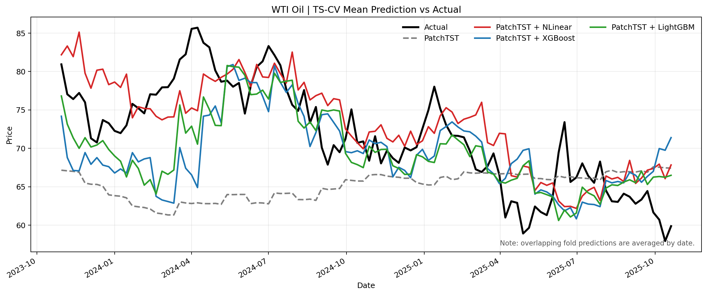
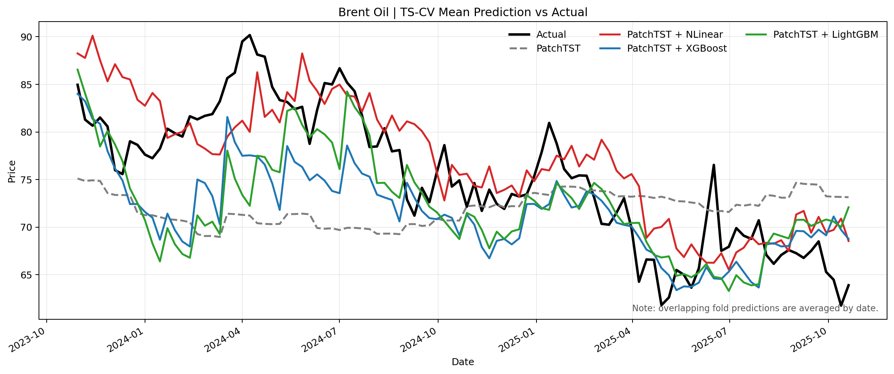
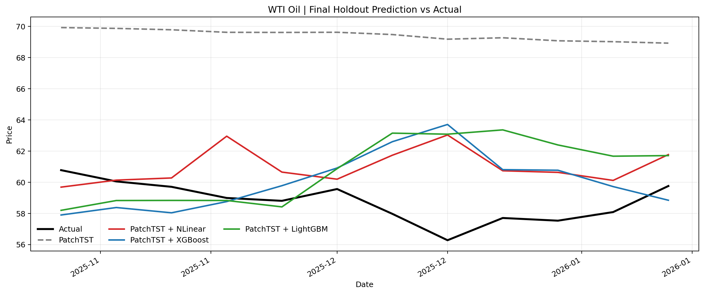
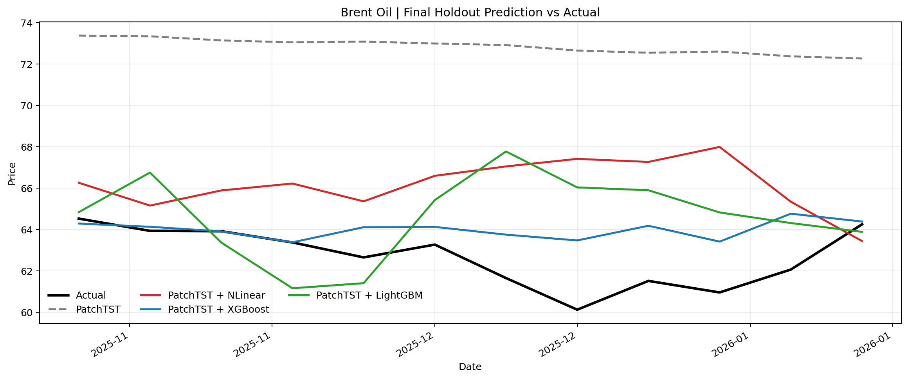

# PatchTST + Residual Correction 결과보고서

본 문서는 [oil_patchtst_residual_benchmark_0318.py](/Users/jaeholee/Desktop/T-LAB/sparta_2/sparta2/oil_patchtst_residual_benchmark_0318.py) 기준의 교수님 보고용 리포트 초안이다.  
기존 `shift(1)` 기반 외생변수 실험은 제외하고, **학계식 단변량 benchmark**에 맞춰 `PatchTST`를 기본모델로 두고 `NLinear`, `XGBoost`, `LightGBM`을 잔차보정모형으로 비교하는 구조로 정리했다.

# 01. 핵심쟁점

---

- `기본모델(Bench-mark)`인 `PatchTST`와 `실험모델(PatchTST + Residual Correction)`을 비교했을 때, **성능 향상이 있는지**
- `잔차보정모형`인 `NLinear`, `XGBoost`, `LightGBM` 중 **어떤 방법론이 가장 일관된 성능 개선을 보이는지**
- 단일 holdout 결과뿐 아니라, **expanding-window ts-cv에서도 성능 개선이 재현되는지**

# 02. 데이터 및 모델 세팅

---

- **예측 타깃:**
  - `WTI Oil`의 현물 가격 (`Com_CrudeOil`)
  - `Brent Oil`의 현물 가격 (`Com_BrentCrudeOil`)
- **예측 단위:**
  - 주간 예측
- **전체 데이터 구간:**
  - `2013-04-01 ~ 2026-01-12` (총 `668주`)
- **평가 프로토콜 공통 설정:**
  - `horizon = 12`
  - `step size = 4`
  - `number of windows = 24`
  - `final holdout = 12`
  - `input size = 48`
  - `season length = 52`
  - 따라서 최근 `116주`가 실질 평가영역이며, `52 x 2 + 12 = 116`으로 계산됨

- **데이터 구간 세팅:**
  - TrainSet 기간: `2013-04-01 ~ 2023-10-23` (총 `552주`, 첫 번째 ts-cv fold의 초기 학습구간)
  - ValidationSet 기간: `2023-10-30 ~ 2025-10-20` (총 `24개 Fold`, expanding window ts-cv)
    - Cross-Validation Fold 1: `2023-10-30 ~ 2024-01-15` (총 `12주`)
    - Cross-Validation Fold 2: `2023-11-27 ~ 2024-02-12` (총 `12주`)
    - Cross-Validation Fold 3: `2023-12-25 ~ 2024-03-11` (총 `12주`)
    - Cross-Validation Fold 4: `2024-01-22 ~ 2024-04-08` (총 `12주`)
    - Cross-Validation Fold 5: `2024-02-19 ~ 2024-05-06` (총 `12주`)
    - Cross-Validation Fold 6: `2024-03-18 ~ 2024-06-03` (총 `12주`)
    - Cross-Validation Fold 7: `2024-04-15 ~ 2024-07-01` (총 `12주`)
    - Cross-Validation Fold 8: `2024-05-13 ~ 2024-07-29` (총 `12주`)
    - Cross-Validation Fold 9: `2024-06-10 ~ 2024-08-26` (총 `12주`)
    - Cross-Validation Fold 10: `2024-07-08 ~ 2024-09-23` (총 `12주`)
    - Cross-Validation Fold 11: `2024-08-05 ~ 2024-10-21` (총 `12주`)
    - Cross-Validation Fold 12: `2024-09-02 ~ 2024-11-18` (총 `12주`)
    - Cross-Validation Fold 13: `2024-09-30 ~ 2024-12-16` (총 `12주`)
    - Cross-Validation Fold 14: `2024-10-28 ~ 2025-01-13` (총 `12주`)
    - Cross-Validation Fold 15: `2024-11-25 ~ 2025-02-10` (총 `12주`)
    - Cross-Validation Fold 16: `2024-12-23 ~ 2025-03-10` (총 `12주`)
    - Cross-Validation Fold 17: `2025-01-20 ~ 2025-04-07` (총 `12주`)
    - Cross-Validation Fold 18: `2025-02-17 ~ 2025-05-05` (총 `12주`)
    - Cross-Validation Fold 19: `2025-03-17 ~ 2025-06-02` (총 `12주`)
    - Cross-Validation Fold 20: `2025-04-14 ~ 2025-06-30` (총 `12주`)
    - Cross-Validation Fold 21: `2025-05-12 ~ 2025-07-28` (총 `12주`)
    - Cross-Validation Fold 22: `2025-06-09 ~ 2025-08-25` (총 `12주`)
    - Cross-Validation Fold 23: `2025-07-07 ~ 2025-09-22` (총 `12주`)
    - Cross-Validation Fold 24: `2025-08-04 ~ 2025-10-20` (총 `12주`)
  - TestSet 기간: `2025-10-27 ~ 2026-01-12` (총 `12주`)

- **피처리스트**
  - 기본모델 (총 `48개` 입력시점)
    - 외생변수 없이, 최근 `48주`의 단변량 시계열만 입력으로 사용

    ```python
    [
        "y[t-47]", "y[t-46]", "y[t-45]", "y[t-44]",
        "y[t-43]", "y[t-42]", "y[t-41]", "y[t-40]",
        "y[t-39]", "y[t-38]", "y[t-37]", "y[t-36]",
        "y[t-35]", "y[t-34]", "y[t-33]", "y[t-32]",
        "y[t-31]", "y[t-30]", "y[t-29]", "y[t-28]",
        "y[t-27]", "y[t-26]", "y[t-25]", "y[t-24]",
        "y[t-23]", "y[t-22]", "y[t-21]", "y[t-20]",
        "y[t-19]", "y[t-18]", "y[t-17]", "y[t-16]",
        "y[t-15]", "y[t-14]", "y[t-13]", "y[t-12]",
        "y[t-11]", "y[t-10]", "y[t-9]",  "y[t-8]",
        "y[t-7]",  "y[t-6]",  "y[t-5]",  "y[t-4]",
        "y[t-3]",  "y[t-2]",  "y[t-1]",  "y[t]"
    ]
    ```

  - 실험모델 (총 `48개` residual 입력시점)
    - `PatchTST`가 만든 one-step fitted residual history만 입력으로 사용
    - `e[t] = y[t] - y_hat_patchtst[t]`

    ```python
    [
        "e[t-47]", "e[t-46]", "e[t-45]", "e[t-44]",
        "e[t-43]", "e[t-42]", "e[t-41]", "e[t-40]",
        "e[t-39]", "e[t-38]", "e[t-37]", "e[t-36]",
        "e[t-35]", "e[t-34]", "e[t-33]", "e[t-32]",
        "e[t-31]", "e[t-30]", "e[t-29]", "e[t-28]",
        "e[t-27]", "e[t-26]", "e[t-25]", "e[t-24]",
        "e[t-23]", "e[t-22]", "e[t-21]", "e[t-20]",
        "e[t-19]", "e[t-18]", "e[t-17]", "e[t-16]",
        "e[t-15]", "e[t-14]", "e[t-13]", "e[t-12]",
        "e[t-11]", "e[t-10]", "e[t-9]",  "e[t-8]",
        "e[t-7]",  "e[t-6]",  "e[t-5]",  "e[t-4]",
        "e[t-3]",  "e[t-2]",  "e[t-1]",  "e[t]"
    ]
    ```

- **모델 세팅**
  - 기본모델 `PatchTST`

    ```python
    patchtst_params = {
        "input_size": 48,
        "horizon": 12,
        "hidden_size": 128,
        "attention_heads": 16,
        "linear_hidden_size": 256,
        "patch_len": 16,
        "stride": 8,
        "dropout": 0.2,
        "encoder_layers": 3,
        "attn_dropout": 0.0,
        "fc_dropout": 0.2,
        "max_steps": 5000,
        "learning_rate": 0.0001,
        "scaler_type": "identity",
    }
    ```

  - 실험모델 `PatchTST + Residual Correction`

    ```python
    residual_models = {
        "NLinear": {
            "input_size": 48,
            "horizon": 12,
            "max_steps": 2000,
            "learning_rate": 0.001,
            "batch_size": 64,
            "patience": 20,
        },
        "XGBoost": {
            "n_estimators": 400,
            "learning_rate": 0.03,
            "max_depth": 4,
            "subsample": 0.8,
            "colsample_bytree": 0.8,
            "reg_alpha": 0.0,
            "reg_lambda": 1.0,
            "early_stopping_rounds": 50,
        },
        "LightGBM": {
            "n_estimators": 400,
            "learning_rate": 0.03,
            "num_leaves": 31,
            "max_depth": 4,
            "min_child_samples": 20,
            "subsample": 0.8,
            "colsample_bytree": 0.8,
            "reg_alpha": 0.0,
            "reg_lambda": 1.0,
            "early_stopping_rounds": 50,
        },
    }
    ```

# 03. 실험 설계 및 적용

---

- 모든 모델은 `shift(1)`을 사용하지 않고, **학계식 단변량 시계열 benchmark**로 구현했다.
- `PatchTST`를 공통 baseline으로 먼저 학습하고, 그 예측 오차로부터 만든 residual history를 `NLinear`, `XGBoost`, `LightGBM`에 각각 입력했다.
- 모든 비교는 동일한 `expanding-window ts-cv 24개 fold`와 동일한 `final holdout 12주` 위에서 수행한다.
- 모든 성능 비교 지표는 `RMSE`, `MAE`, `MAPE`, `NRMSE(max-min)` 기준으로 통일한다.
- 결과표는 이미지 예시처럼 leaderboard 형태로 정리하되, `Residual Model` 열을 추가하여 `residual 미적용(-)`과 `residual 적용`을 같은 표 안에서 직접 비교할 수 있도록 구성한다.

# 04. 실험(모델링) 결과

### 04-01. 결과 요약 (MAPE 기준)

---

- 아래 요약표는 `MAPE` 기준으로 baseline 대비 residual correction의 개선 여부를 정리하기 위한 표이다.
- 실제 수치는 [leaderboard_tscv.csv](/Users/jaeholee/Desktop/T-LAB/sparta_2/sparta2/output_oil_patchtst_residual_0318/leaderboard_tscv.csv) 와 [leaderboard_holdout.csv](/Users/jaeholee/Desktop/T-LAB/sparta_2/sparta2/output_oil_patchtst_residual_0318/leaderboard_holdout.csv) 기준으로 기입했다.

| Target | Baseline | Residual Model | Bench-mark MAPE (%) | 실험모델 MAPE (%) | 증감 (%p) |
| --- | --- | --- | --- | --- | --- |
| WTI Oil | PatchTST | NLinear | 11.292 | 6.546 | -4.745 |
| WTI Oil | PatchTST | LightGBM | 11.292 | 7.621 | -3.671 |
| WTI Oil | PatchTST | XGBoost | 11.292 | 8.708 | -2.584 |
| Brent Oil | PatchTST | NLinear | 9.292 | 6.243 | -3.049 |
| Brent Oil | PatchTST | XGBoost | 9.292 | 7.439 | -1.853 |
| Brent Oil | PatchTST | LightGBM | 9.292 | 7.825 | -1.467 |

- **핵심 Leaderboard**
  - 발표용 메인 표는 아래 `ts-cv` 기준 leaderboard를 사용하는 것이 가장 적절하다.
  - 형식은 `Target | Baseline Model | Residual Model | RMSE | MAE | MAPE | NRMSE`로 통일했다.

| Target | Baseline Model | Residual Model | RMSE | MAE | MAPE | NRMSE |
| --- | --- | --- | --- | --- | --- | --- |
| WTI Oil | PatchTST | `-` | 10.556 | 8.512 | 11.292 | 0.380 |
| WTI Oil | PatchTST | `NLinear` | **5.789** | **4.654** | **6.546** | **0.208** |
| WTI Oil | PatchTST | `LightGBM` | 7.292 | 5.576 | 7.621 | 0.263 |
| WTI Oil | PatchTST | `XGBoost` | 8.318 | 6.379 | 8.708 | 0.299 |
| Brent Oil | PatchTST | `-` | 8.874 | 7.210 | 9.292 | 0.312 |
| Brent Oil | PatchTST | `NLinear` | **5.834** | **4.688** | **6.243** | **0.205** |
| Brent Oil | PatchTST | `XGBoost` | 7.725 | 5.792 | 7.439 | 0.272 |
| Brent Oil | PatchTST | `LightGBM` | 7.993 | 6.088 | 7.825 | 0.281 |

### 04-02. 세부 결과

---

- **ts-cv Leaderboard**
  - ValidationSet 기간: `2023-10-30 ~ 2025-10-20` (총 `24개 Fold`)
  - 정렬 기준: 각 타깃 내 `MAPE` 오름차순
  - Plot
    - `ts-cv`는 overlapping fold 예측이므로 동일 날짜 예측값을 평균해 actual과 비교

    | Target | Baseline Model | Residual Model | RMSE | MAE | MAPE | NRMSE |
    | --- | --- | --- | --- | --- | --- | --- |
    | WTI Oil | PatchTST | `-` | 10.556 | 8.512 | 11.292 | 0.380 |
    | WTI Oil | PatchTST | `NLinear` | 5.789 | 4.654 | 6.546 | 0.208 |
    | WTI Oil | PatchTST | `LightGBM` | 7.292 | 5.576 | 7.621 | 0.263 |
    | WTI Oil | PatchTST | `XGBoost` | 8.318 | 6.379 | 8.708 | 0.299 |
    | Brent Oil | PatchTST | `-` | 8.874 | 7.210 | 9.292 | 0.312 |
    | Brent Oil | PatchTST | `NLinear` | 5.834 | 4.688 | 6.243 | 0.205 |
    | Brent Oil | PatchTST | `XGBoost` | 7.725 | 5.792 | 7.439 | 0.272 |
    | Brent Oil | PatchTST | `LightGBM` | 7.993 | 6.088 | 7.825 | 0.281 |

    

    

- **Test Set Metric**
  - TestSet 기간: `2025-10-27 ~ 2026-01-12` (총 `12주`)
  - Plot
    - 실제값 vs 예측값 비교는 [window_predictions.csv](/Users/jaeholee/Desktop/T-LAB/sparta_2/sparta2/output_oil_patchtst_residual_0318/window_predictions.csv) 기준으로 생성

    | Target | Baseline Model | Residual Model | RMSE | MAE | MAPE | NRMSE |
    | --- | --- | --- | --- | --- | --- | --- |
    | WTI Oil | PatchTST | `-` | 10.732 | 10.680 | 18.217 | 2.386 |
    | WTI Oil | PatchTST | `NLinear` | 2.997 | 2.406 | 4.149 | 0.666 |
    | WTI Oil | PatchTST | `XGBoost` | 3.121 | 2.476 | 4.263 | 0.694 |
    | WTI Oil | PatchTST | `LightGBM` | 3.607 | 2.881 | 4.965 | 0.802 |
    | Brent Oil | PatchTST | `-` | 10.241 | 10.168 | 16.267 | 2.328 |
    | Brent Oil | PatchTST | `XGBoost` | 1.802 | 1.347 | 2.189 | 0.410 |
    | Brent Oil | PatchTST | `LightGBM` | 3.304 | 2.680 | 4.334 | 0.751 |
    | Brent Oil | PatchTST | `NLinear` | 4.192 | 3.612 | 5.834 | 0.953 |

    

    

- **핵심 해석**
  - `ts-cv` 기준으로는 `WTI Oil`, `Brent Oil` 모두 `NLinear` residual correction이 가장 우수했다.
  - `holdout` 기준으로는 `WTI Oil`은 `NLinear`, `Brent Oil`은 `XGBoost`가 가장 낮은 오차를 보였다.
  - 세 residual model 모두 baseline `PatchTST`보다는 큰 폭의 개선을 보였지만, `LightGBM`는 두 타깃 모두에서 최상위는 아니었다.

# 05. 결론 및 얻게 된 인사이트

---

- `WTI Oil`에서는 `NLinear` residual correction이 `ts-cv`와 `holdout` 모두에서 가장 안정적인 개선을 보였다.
- `Brent Oil`에서는 `ts-cv` 기준 `NLinear`가 가장 우수했지만, 최종 `holdout`에서는 `XGBoost`가 가장 낮은 오차를 기록했다.
- 세 residual correction model 모두 baseline `PatchTST` 대비 성능 개선을 만들었으므로, 이번 실험에서는 `residual correction`의 유효성 자체는 분명하게 확인되었다.
- 다만 최종 선택 모델은 `타깃별`로 다르게 가져가는 것이 더 합리적이며, `WTI = NLinear`, `Brent = NLinear/XGBoost 경합`으로 정리하는 것이 정확하다.

# 06. 향후 Action Plan

---

- `WTI Oil` 발표본에서는 `PatchTST + NLinear`를 우선 실험모델로 제시하는 것이 가장 설득력 있다.
- `Brent Oil` 발표본에서는 `ts-cv best = NLinear`, `holdout best = XGBoost`를 함께 제시하고, 최종 선택 기준을 추가 논의하는 것이 좋다.
- `LightGBM`는 baseline 대비 개선은 있었지만 최상위 모델은 아니므로, 부가 실험 또는 보조모델로 배치하는 편이 적절하다.
- 최종 발표본에서는 `Target | Baseline Model | Residual Model | RMSE | MAE | MAPE | NRMSE` 형식의 leaderboard를 핵심 표로 사용하고, 각 타깃별 best row만 별도 강조한다.
