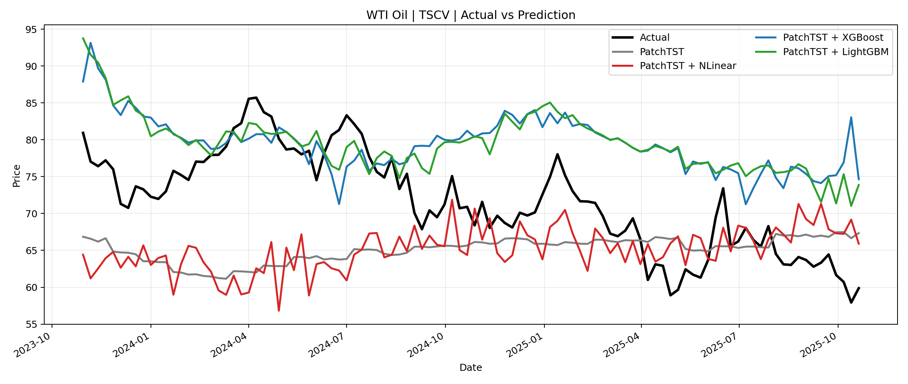
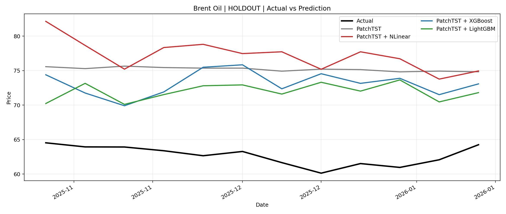

# 01. 핵심쟁점

---

- `기본모델(PatchTST)`과 `실험모델(Residual Correction)`을 비교했을 때, **동일한 단변량 horizon-12 benchmark에서 성능 향상이 있는지**
- `NLinear`, `XGBoost`, `LightGBM` 중 어떤 잔차보정모형이 `ts-cv` 평균 기준과 `최종 holdout` 기준에서 가장 안정적인지

# 02. 데이터 및 모델 세팅

---

- **예측 타깃**
  - `WTI Oil` 현물 가격 (`Com_CrudeOil`)
  - `Brent Oil` 현물 가격 (`Com_BrentCrudeOil`)
- **예측 단위**
  - 주간 예측
- **시계열 구성**
  - 각 타깃은 **별도의 단변량 시계열**로 구성

- **실험에 사용된 전체 구간**
  - `2013-04-01 ~ 2026-01-12` (총 `668개` 주간 관측치)

- **평가 프로토콜 공통 설정**
  - `horizon = 12`
  - `step size = 4`
  - `number of windows = 24`
  - `final holdout = 12`
  - `input size = 48`
  - `season length = 52`
  - 최근 `116주`가 실질적인 평가 영역이며, 이는 `ts-cv 104주 + final holdout 12주 = 52*2 + 12`로 계산

- **데이터 구간 세팅**
  - TrainSet 기간: `2013-04-01 ~ 2023-10-23` (총 `552주`)
  - ValidationSet 기간: `2023-10-30 ~ 2025-10-20` (총 `24개 Fold`, 고유 평가일수 `104주`)
    - Cross-Validation Fold 1: `2023-10-30 ~ 2024-01-15` (총 `12주`)
    - Cross-Validation Fold 2: `2023-11-27 ~ 2024-02-12` (총 `12주`)
    - Cross-Validation Fold 3: `2023-12-25 ~ 2024-03-11` (총 `12주`)
    - Cross-Validation Fold 4: `2024-01-22 ~ 2024-04-08` (총 `12주`)
    - Cross-Validation Fold 5: `2024-02-19 ~ 2024-05-06` (총 `12주`)
    - Cross-Validation Fold 6: `2024-03-18 ~ 2024-06-03` (총 `12주`)
    - Cross-Validation Fold 7: `2024-04-15 ~ 2024-07-01` (총 `12주`)
    - Cross-Validation Fold 8: `2024-05-13 ~ 2024-07-29` (총 `12주`)
    - Cross-Validation Fold 9: `2024-06-10 ~ 2024-08-26` (총 `12주`)
    - Cross-Validation Fold 10: `2024-07-08 ~ 2024-09-23` (총 `12주`)
    - Cross-Validation Fold 11: `2024-08-05 ~ 2024-10-21` (총 `12주`)
    - Cross-Validation Fold 12: `2024-09-02 ~ 2024-11-18` (총 `12주`)
    - Cross-Validation Fold 13: `2024-09-30 ~ 2024-12-16` (총 `12주`)
    - Cross-Validation Fold 14: `2024-10-28 ~ 2025-01-13` (총 `12주`)
    - Cross-Validation Fold 15: `2024-11-25 ~ 2025-02-10` (총 `12주`)
    - Cross-Validation Fold 16: `2024-12-23 ~ 2025-03-10` (총 `12주`)
    - Cross-Validation Fold 17: `2025-01-20 ~ 2025-04-07` (총 `12주`)
    - Cross-Validation Fold 18: `2025-02-17 ~ 2025-05-05` (총 `12주`)
    - Cross-Validation Fold 19: `2025-03-17 ~ 2025-06-02` (총 `12주`)
    - Cross-Validation Fold 20: `2025-04-14 ~ 2025-06-30` (총 `12주`)
    - Cross-Validation Fold 21: `2025-05-12 ~ 2025-07-28` (총 `12주`)
    - Cross-Validation Fold 22: `2025-06-09 ~ 2025-08-25` (총 `12주`)
    - Cross-Validation Fold 23: `2025-07-07 ~ 2025-09-22` (총 `12주`)
    - Cross-Validation Fold 24: `2025-08-04 ~ 2025-10-20` (총 `12주`)
  - TestSet 기간: `2025-10-27 ~ 2026-01-12` (총 `12주`)

- **피처리스트**
  - 기본모델

    ```python
    [target_series_only]
    ```

  - 실험모델
    - 동일한 단변량 입력(`48주 history`)을 사용하고, baseline의 inner OOF residual을 `12-step residual target`으로 학습

- **모델 세팅**
  - 기본모델 `PatchTST`

    ```python
    patchtst_params = {
        "hidden_size": 128,
        "attention_heads": 16,
        "linear_hidden_size": 256,
        "patch_len": 16,
        "stride": 8,
        "dropout": 0.2,
        "encoder_layers": 3,
        "attn_dropout": 0.0,
        "fc_dropout": 0.2,
        "max_steps": 5000,
        "learning_rate": 0.0001,
        "scaler_type": "identity",
        "batch_size": 32,
        "patience": 12,
    }
    ```

  - 실험모델 `Residual Correction`

    ```python
    residual_models = {
        "NLinear": {
            "architecture": "Linear(48 -> 12)",
            "last_value_normalization": True,
            "max_steps": 300,
            "learning_rate": 0.001,
        },
        "XGBoost": {"n_estimators": 200, "learning_rate": 0.03, "max_depth": 4},
        "LightGBM": {"n_estimators": 200, "learning_rate": 0.03, "max_depth": 4},
    }
    ```

# 03. 실험 설계 및 적용

---

- 모든 비교는 **단변량 direct 12-step forecasting protocol**에서 수행했다.
- outer 평가는 `expanding window ts-cv 24개`와 `최종 holdout 12주`로 분리했다.
- 잔차보정모형은 baseline의 `in-sample residual`이 아니라, 각 outer train 안에서 생성한 **inner OOF PatchTST residual**을 학습했다.
- `NLinear`는 구현 audit 후 hidden-layer MLP가 아닌 **선형 direct residual head**로 교정했다.
- `ts-cv` 결과는 overlapping forecast가 존재하므로, 같은 날짜에 대한 예측을 평균낸 뒤 `RMSE`, `MAE`, `MAPE`, `NRMSE`를 계산했다.
- `NRMSE`는 각 타깃의 전체 range(`2013-04-01 ~ 2026-01-12`)로 고정 정규화했다.
- 따라서 본 결과는 이전 exploratory `rolling 1-step` 결과와 직접 비교하면 안 되며, **이번 문단에서 정의한 strict benchmark의 결과값**으로만 해석해야 한다.

# 04. 실험(모델링) 결과

### 04-01. 결과 요약 (MAPE 기준)

---

- **TS-CV 평균**
  - `WTI Oil`: `Naive(last value)`가 전체 최고
  - `Brent Oil`: `Naive(last value)`가 전체 최고
  - learned model 내부 비교에서는 `WTI`, `Brent` 모두 `PatchTST baseline` 자체가 최고
- **최종 Holdout 12주**
  - `WTI Oil`: `Naive(last value)`가 전체 최고
  - `Brent Oil`: `Naive(last value)`가 전체 최고
  - learned model 내부 비교에서는 `WTI = PatchTST + XGBoost`, `Brent = PatchTST + LightGBM`가 최고

- **핵심 해석**
  - 신뢰 가능한 전체 결과 기준에서는 `Naive(last value)`가 `TS-CV`와 `Holdout` 모두에서 가장 강했음
  - 구현 audit 후 교정된 `NLinear`는 `TS-CV`와 `Holdout` 모두에서 우위를 보이지 못했음
  - learned model 내부 비교로 한정하면, `TS-CV`는 `PatchTST baseline` 자체가 가장 안정적이었음
  - `최종 holdout 12주`의 learned model 내부 최적 residual은 `WTI=XGBoost`, `Brent=LightGBM`였음
  - 따라서 본 보고서의 메인 표는 `Naive 포함 통합 leaderboard`를 사용하고, `PatchTST vs residual` 비교는 보조 해석으로만 다룸

- **PatchTST 대비 Residual 요약 (TS-CV, MAPE 기준)**

| Target | Bench-mark (PatchTST, %) | 실험모델 (Best Residual, %) | 증감 (%) |
| --- | --- | --- | --- |
| WTI Oil | 11.164 | 11.504 (`NLinear`) | +0.340 |
| Brent Oil | 9.097 | 9.972 (`NLinear`) | +0.875 |

- **핵심 Leaderboard (TS-CV, date-averaged)**
  - 기준 파일: [leaderboard_tscv_with_naive.csv](output_oil_univariate_direct_residual_0320/leaderboard_tscv_with_naive.csv)

| Target | Baseline Model | Residual Model | RMSE | MAE | MAPE | NRMSE |
| --- | --- | --- | --- | --- | --- | --- |
| Brent Oil | Naive | `-` | **4.531** | **3.591** | **4.849** | **0.046** |
| Brent Oil | PatchTST | `-` | 8.460 | 7.021 | 9.097 | 0.087 |
| Brent Oil | PatchTST | `NLinear` | 9.250 | 7.688 | 9.972 | 0.095 |
| Brent Oil | PatchTST | `LightGBM` | 10.586 | 9.317 | 12.945 | 0.109 |
| Brent Oil | PatchTST | `XGBoost` | 11.361 | 9.953 | 13.858 | 0.117 |
| WTI Oil | Naive | `-` | **4.933** | **4.040** | **5.745** | **0.049** |
| WTI Oil | PatchTST | `LightGBM` | 9.857 | 8.561 | 12.552 | 0.098 |
| WTI Oil | PatchTST | `XGBoost` | 10.225 | 8.855 | 12.996 | 0.102 |
| WTI Oil | PatchTST | `-` | 10.264 | 8.377 | 11.164 | 0.102 |
| WTI Oil | PatchTST | `NLinear` | 10.728 | 8.620 | 11.504 | 0.107 |

### 04-02. 세부 결과

---

- **TS-CV Leaderboard**
  - 기준 파일: [leaderboard_tscv_with_naive.csv](output_oil_univariate_direct_residual_0320/leaderboard_tscv_with_naive.csv)

| Target | Baseline Model | Residual Model | RMSE | MAE | MAPE | NRMSE |
| --- | --- | --- | --- | --- | --- | --- |
| Brent Oil | Naive | `-` | **4.531** | **3.591** | **4.849** | **0.046** |
| Brent Oil | PatchTST | `-` | 8.460 | 7.021 | 9.097 | 0.087 |
| Brent Oil | PatchTST | `NLinear` | 9.250 | 7.688 | 9.972 | 0.095 |
| Brent Oil | PatchTST | `LightGBM` | 10.586 | 9.317 | 12.945 | 0.109 |
| Brent Oil | PatchTST | `XGBoost` | 11.361 | 9.953 | 13.858 | 0.117 |
| WTI Oil | Naive | `-` | **4.933** | **4.040** | **5.745** | **0.049** |
| WTI Oil | PatchTST | `LightGBM` | 9.857 | 8.561 | 12.552 | 0.098 |
| WTI Oil | PatchTST | `XGBoost` | 10.225 | 8.855 | 12.996 | 0.102 |
| WTI Oil | PatchTST | `-` | 10.264 | 8.377 | 11.164 | 0.102 |
| WTI Oil | PatchTST | `NLinear` | 10.728 | 8.620 | 11.504 | 0.107 |

- **Test Set Metric**
  - TestSet 기간: `2025-10-27 ~ 2026-01-12` (총 `12주`)
  - 기준 파일: [leaderboard_holdout_with_naive.csv](output_oil_univariate_direct_residual_0320/leaderboard_holdout_with_naive.csv)

| Target | Baseline Model | Residual Model | RMSE | MAE | MAPE | NRMSE |
| --- | --- | --- | --- | --- | --- | --- |
| Brent Oil | Naive | `-` | **1.818** | **1.383** | **2.247** | **0.019** |
| Brent Oil | PatchTST | `LightGBM` | 9.525 | 9.272 | 14.863 | 0.098 |
| Brent Oil | PatchTST | `XGBoost` | 10.726 | 10.458 | 16.750 | 0.110 |
| Brent Oil | PatchTST | `-` | 12.578 | 12.516 | 20.016 | 0.129 |
| Brent Oil | PatchTST | `NLinear` | 14.683 | 14.533 | 23.212 | 0.151 |
| WTI Oil | Naive | `-` | **1.648** | **1.279** | **2.212** | **0.016** |
| WTI Oil | PatchTST | `XGBoost` | 8.328 | 8.095 | 13.827 | 0.083 |
| WTI Oil | PatchTST | `LightGBM` | 8.369 | 8.112 | 13.865 | 0.084 |
| WTI Oil | PatchTST | `-` | 9.348 | 9.282 | 15.839 | 0.093 |
| WTI Oil | PatchTST | `NLinear` | 13.073 | 12.851 | 21.935 | 0.131 |

- **보조 해석**
  - learned model끼리만 비교하면 `TS-CV`는 `PatchTST baseline`, `Holdout`은 `WTI=XGBoost`, `Brent=LightGBM`가 가장 좋았다.
  - 다만 이 비교는 어디까지나 `Naive`를 제외한 learned-model family 내부의 상대 비교로 해석한다.

- **Plot**
  - plot manifest: [plot_manifest.csv](output_oil_univariate_direct_residual_0320/plot_manifest.csv)





# 05. 결론 및 얻게 된 인사이트

---

- 구현 audit 후 교정된 `NLinear`는 사용자가 정의한 `strict univariate direct horizon-12 benchmark` 기준에서 우위를 보이지 못했다.
- `최종 holdout 12주`에서도 `Naive(last value)`가 가장 좋았다.
- 즉, 이번 exact setting 결과는 `tree-based residual correction은 holdout에서 일부 개선을 만들 수 있지만`, 현재 단계에서는 `전체 기준 최고 모델은 Naive`라는 결론으로 정리하는 것이 가장 방어적이다.
- `PatchTST vs residual` 비교는 `custom PatchTST baseline 내부의 상대 비교`로만 해석해야 한다.
- 이전의 `1점대 성능`은 다른 프로토콜이나 단일 confirmatory 세팅, 또는 교정 전 구현에서 나온 값일 가능성이 높고, 본 결과와 직접 비교하면 안 된다.

# 06. 향후 Action Plan

---

- 발표본 메인 결과는 이 strict benchmark 결과만 사용한다.
- `ts-cv best model`과 `holdout best model`을 분리해서 설명한다.
- 발표 메인 표는 반드시 `Naive 포함 통합 leaderboard`를 사용한다.
- learned model 결과를 제시할 때는 `전체 1위`가 아니라 `learned-model 내부 비교`임을 명시한다.
- 이전 `NLinear 우세` 로그는 교정 전 구현과 직접 비교하지 않는다.
- 후속 실험은 `공식 PatchTST 구현 사용 또는 현재 구현 재검증`, `residual learner 입력 구조 보강`, `single-target confirmatory rerun` 순서로 진행한다.
- 이전 `rolling 1-step` 및 `multivariate+exogenous` 결과는 부록/reference로만 남긴다.
