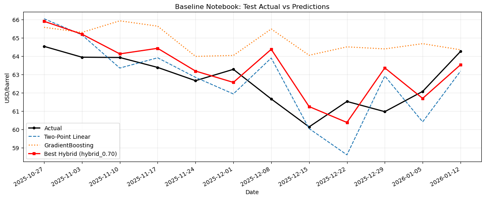
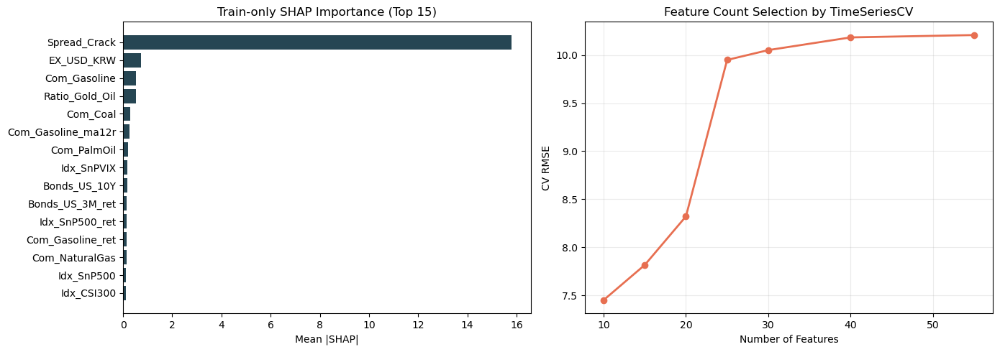
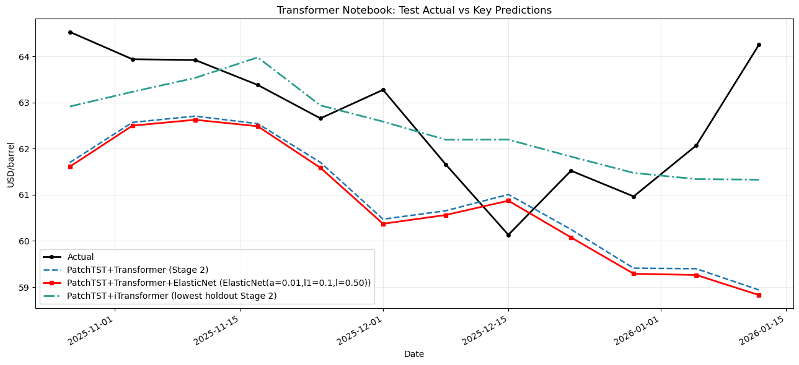
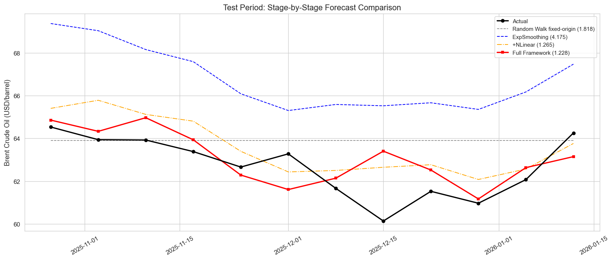
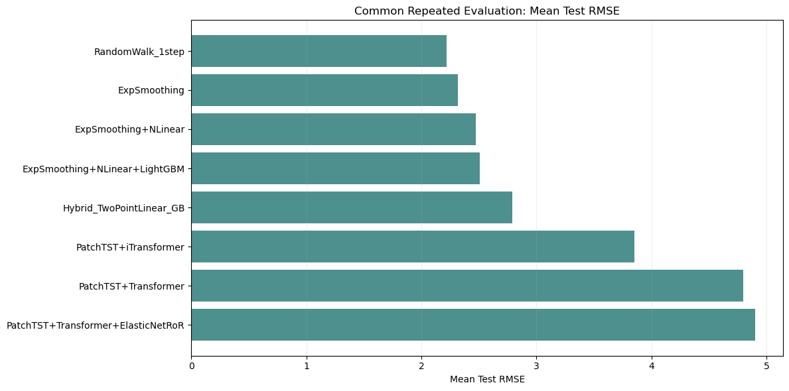

# 유가 예측 실험 보고서

## 결론 요약
- 본 보고서는 `공식 단일 분할 결과`와 `추가 점검용 반복 평가 결과`를 분리해서 제시한다. 단일 분할 결과는 각 노트북의 목적을 확인하는 데 사용하고, 서로 다른 계열의 직접 비교는 반복 평가 결과를 기준으로 읽는다.
- 기준선 재현 노트북의 최적 혼합 모형은 `Hybrid_TwoPointLinear0.7_GB0.3`이며 시험 RMSE는 `1.3440`이었다.
- Transformer 조합 탐색 노트북의 공식 선정 모형은 `PatchTST + Transformer + ElasticNet`이고 검증 RMSE는 `1.2443`이었다. 같은 공식 단일 분할에서 시험 RMSE가 가장 낮았던 조합은 `PatchTST + iTransformer`의 `1.2308`이었다.
- STL 단계 설명 노트북에서는 `Exponential Smoothing + NLinear + LightGBM` 구조가 시험 RMSE `1.2275`를 기록하였다. 다만 이 노트북의 목적은 전체 최종 우승 모형 선정이 아니라, `baseline -> 잔차 보정 -> 2차 잔차 보정` 구조의 역할을 설명하는 데 있다.
- 추가 점검용 반복 평가는 `2025-10-27` 한 번의 결과가 다른 시작점에서도 다시 나오는지 확인하기 위한 절차이다. 단일 분할이 `한 번만 본 성적표`라면, 반복 평가는 다섯 개 시작점(`2024-11-25`, `2025-02-17`, `2025-05-12`, `2025-08-04`, `2025-10-27`)으로 다시 본 `평균 성적표`에 해당한다.
- 반복 평가의 평균 오차가 공식 단일 분할보다 큰 이유는 모델이 갑자기 잘못되었기 때문이 아니라, 더 어려운 구간과 더 짧은 학습 이력이 함께 포함되기 때문이다.
- 현재 자료에서는 2차 잔차 보정이 일부 단일 분할에서는 개선을 보였지만, 반복 평가 평균에서는 그 이득이 안정적으로 재현되지 않았다.

**표 1. 공식 단일 분할 통합 성능표**
| 실험 묶음 | 모형명 | 1단계 기본 예측 | 2단계 잔차 보정 | 3단계 2차 잔차 보정 | 검증 RMSE | 시험 RMSE | 시험 MAE | 시험 MAPE(%) | 시험 NRMSE(%) | 시험 R² |
| --- | --- | --- | --- | --- | --- | --- | --- | --- | --- | --- |
| 공식 단일 분할 / 기준선 재현 | TwoPointLinear | 직전 2시점 선형 외삽 | - | - | - | 1.5125 | 1.2740 | 2.0383 | 2.4125 | -0.2435 |
| 공식 단일 분할 / 기준선 재현 | GradientBoosting | GradientBoosting | - | - | - | 2.4451 | 2.1321 | 3.4385 | 3.9001 | -2.2501 |
| 공식 단일 분할 / 기준선 재현 | Hybrid_TwoPointLinear0.7_GB0.3 | 직전 2시점 선형 외삽 | GradientBoosting | - | 2.3013 | 1.3440 | 1.1317 | 1.8162 | 2.1437 | 0.0181 |
| 공식 단일 분할 / 기준선 재현 | Hybrid_TwoPointLinear0.8_GB0.2 | 직전 2시점 선형 외삽 | GradientBoosting | - | 2.4552 | 1.3474 | 1.1522 | 1.8476 | 2.1491 | 0.0131 |
| 공식 단일 분할 / 기준선 재현 | Hybrid_TwoPointLinear0.9_GB0.1 | 직전 2시점 선형 외삽 | GradientBoosting | - | 2.6261 | 1.4056 | 1.2056 | 1.9305 | 2.2421 | -0.0741 |
| 공식 단일 분할 / Transformer 2단계 | PatchTST+Transformer | PatchTST | Transformer | - | 1.2580 | 2.2752 | 1.8934 | 3.0008 | 3.6290 | -1.8139 |
| 공식 단일 분할 / Transformer 2단계 | PatchTST+LSTM | PatchTST | LSTM | - | 1.2839 | 2.7910 | 2.4421 | 3.8627 | 4.4518 | -3.2345 |
| 공식 단일 분할 / Transformer 2단계 | LSTM+PatchTST | LSTM | PatchTST | - | 1.2870 | 1.7378 | 1.4026 | 2.2159 | 2.7718 | -0.6416 |
| 공식 단일 분할 / Transformer 2단계 | Transformer+PatchTST | Transformer | PatchTST | - | 1.2922 | 1.5927 | 1.2079 | 1.9128 | 2.5404 | -0.3790 |
| 공식 단일 분할 / Transformer 2단계 | PatchTST+iTransformer | PatchTST | iTransformer | - | 1.3534 | 1.2308 | 0.9460 | 1.5054 | 1.9633 | 0.1764 |
| 공식 단일 분할 / Transformer 2단계 | Transformer+iTransformer | Transformer | iTransformer | - | 1.4456 | 1.4526 | 1.0756 | 1.7098 | 2.3170 | -0.1471 |
| 공식 단일 분할 / Transformer 2단계 | PatchTST+PatchTST | PatchTST | PatchTST | - | 1.4880 | 1.5401 | 0.9420 | 1.4996 | 2.4565 | -0.2894 |
| 공식 단일 분할 / Transformer 2단계 | Transformer+Transformer | Transformer | Transformer | - | 1.4914 | 1.4453 | 1.0649 | 1.7010 | 2.3054 | -0.1356 |
| 공식 단일 분할 / Transformer 3단계 | PatchTST+Transformer | PatchTST | Transformer | ElasticNet | 1.2443 | 2.3577 | 1.9775 | 3.1342 | 3.7607 | -2.0219 |
| 공식 단일 분할 / Transformer 3단계 | LSTM+PatchTST | LSTM | PatchTST | LightGBM(전체 변수) | 1.2524 | 1.5402 | 1.2384 | 1.9586 | 2.4568 | -0.2896 |
| 공식 단일 분할 / Transformer 3단계 | PatchTST+LSTM | PatchTST | LSTM | LightGBM(전체 변수) | 1.2789 | 2.7255 | 2.3836 | 3.7710 | 4.3474 | -3.0382 |
| 공식 단일 분할 / STL 단계별 | Random Walk (fixed-origin) | Random Walk (fixed-origin) | - | - | 4.9551 | 1.8184 | 1.3834 | 2.2474 | 2.9005 | -0.7975 |
| 공식 단일 분할 / STL 단계별 | ExpSmoothing (Baseline) | Exponential Smoothing | - | - | 5.2599 | 4.1754 | 4.0857 | 6.5276 | 6.6601 | -8.4774 |
| 공식 단일 분할 / STL 단계별 | Baseline + NLinear | Exponential Smoothing | NLinear | - | 3.1619 | 1.2648 | 1.1353 | 1.8192 | 2.0175 | 0.1304 |
| 공식 단일 분할 / STL 단계별 | Full Framework (B+NL+RoR) | Exponential Smoothing | NLinear | LightGBM | 2.7126 | 1.2275 | 0.9144 | 1.4708 | 1.9580 | 0.1809 |

주: 표 1은 각 노트북의 공식 단일 분할 내부 결과만 묶어 정리한 것이다. `NRMSE(%)`는 같은 평가 구간의 실제 유가 평균으로 정규화한 RMSE이다.

**표 2. 추가 점검용 반복 평가 통합 성능표**
| 평가 규칙 묶음 | 계열 | 모형명 | 평균 검증 RMSE | 평균 시험 RMSE | 평균 시험 MAE | 평균 시험 MAPE(%) | 평균 시험 NRMSE(%) | 평균 시험 R² | 시험 RMSE 표준편차 | 반복 수 |
| --- | --- | --- | --- | --- | --- | --- | --- | --- | --- | --- |
| 반복 평가 / 운용형 benchmark | Benchmark | 1-step Random Walk | 2.5866 | 2.2191 | 1.7232 | 2.5226 | 3.2399 | 0.2444 | 0.9941 | 5 |
| 반복 평가 / 구조 모형 비교 | STL | ExpSmoothing | 2.7231 | 2.3195 | 1.8237 | 2.6705 | 3.3882 | 0.2012 | 1.0900 | 5 |
| 반복 평가 / 구조 모형 비교 | STL | ExpSmoothing+NLinear | 2.7116 | 2.4743 | 2.0201 | 2.9664 | 3.6189 | 0.0341 | 1.0695 | 5 |
| 반복 평가 / 구조 모형 비교 | STL | ExpSmoothing+NLinear+LightGBM | 2.6116 | 2.5089 | 2.0283 | 2.9828 | 3.6746 | -0.0218 | 0.8873 | 5 |
| 반복 평가 / 구조 모형 비교 | Baseline | Hybrid_TwoPointLinear_GB | 3.2192 | 2.7912 | 2.1008 | 3.1218 | 4.0827 | -0.1934 | 1.2916 | 5 |
| 반복 평가 / 구조 모형 비교 | Transformer | PatchTST+iTransformer | 2.4166 | 3.8544 | 3.2649 | 4.9064 | 5.5767 | -1.1695 | 2.9055 | 5 |
| 반복 평가 / 구조 모형 비교 | Transformer | PatchTST+Transformer | 2.5466 | 4.7979 | 4.2536 | 6.4224 | 6.9462 | -2.5002 | 3.1178 | 5 |
| 반복 평가 / 구조 모형 비교 | Transformer | PatchTST+Transformer+ElasticNetRoR | 2.5045 | 4.8990 | 4.3572 | 6.5883 | 7.1079 | -2.7665 | 3.0065 | 5 |

주: 표 2는 반복 원점 평가 결과를 모은 표이다. 첫 행의 `1-step Random Walk`는 운용형 참고 benchmark이고, 그 아래 행들은 같은 반복 원점 규칙 아래 비교한 구조 모형들이다.

## 1. 서론
본 실험의 목적은 두 가지이다. 첫째, 메인 브랜치의 니켈 예측 구조가 유가에서도 강한 기준선이 되는지 확인한다. 둘째, 변수 선택, transformer 조합, 잔차 보정, STL 분해가 그 기준선을 실제로 넘어설 수 있는지 점검한다.

이를 위해 세 개의 제출 노트북을 구성하였다. 기준선 재현 노트북은 재현 기준선을 만든다. Transformer 조합 탐색 노트북은 공식 단일 분할에서 transformer 계열의 조합을 고른다. STL 단계 설명 노트북은 구조 분해 기반 단계별 보정이 어떻게 작동하는지 설명한다.

## 2. 문서를 읽는 방법과 제출 파일 역할
이 보고서는 먼저 각 파일이 무엇을 보여주는 문서인지 구분해서 읽어야 한다. 단일 분할 노트북 세 개와 추가 점검용 반복 평가는 역할이 다르다.

**표 3. 파일과 추가 점검 절차의 역할**
| 항목 | 파일명 또는 도구 | 이 자료가 답하는 질문 | 이 자료만으로 답하지 않는 질문 |
| --- | --- | --- | --- |
| 기준선 재현 노트북 | `01_oil_nickel_style_hybrid.ipynb` | 니켈 메인 구조를 유가에 옮겼을 때 강한 기준선이 만들어지는가 | 다른 계열보다 항상 우수한가 |
| Transformer 조합 탐색 노트북 | `02_oil_transformer_advanced.ipynb` | 공식 단일 분할에서 transformer 계열 안의 어떤 조합을 채택할 것인가 | 다른 계열과 직접 비교했을 때도 가장 안정적인가 |
| STL 단계 설명 노트북 | `03_oil_stl_residual_ror.ipynb` | `baseline -> 잔차 보정 -> 2차 잔차 보정` 구조가 내부적으로 어떻게 작동하는가 | 전체 프로젝트의 최종 우승 모형은 무엇인가 |
| 추가 점검용 반복 평가 | `oil_common_protocol_backtest.py` | 위 후보들이 여러 시작점에서도 반복 원점 규칙 아래 비슷한 성능을 내는가 | 특정 한 노트북의 내부 단계가 왜 좋아졌는가 |

추가 점검용 반복 평가는 네 번째 제출 파일이 아니라, 세 노트북의 결과를 같은 규칙 아래 다시 확인하기 위해 추가한 검증 절차이다. 단일 분할 한 번만으로는 특정 구간에 우연히 유리한 결과를 일반적 성능으로 오해할 수 있기 때문에 이 절이 필요하다.

## 3. 공통 데이터 설정
### 3.1 데이터 개요
- 파일명: `data_weekly_260120.csv`
- 관측 주기: 주간
- 전체 기간: `2013-04-01` ~ `2026-01-12`
- 총 관측치: 668주
- 예측 대상 변수: `Com_BrentCrudeOil`

### 3.2 예측 대상 변수와 설명변수
- 예측 대상 변수 `y_t`: 시점 `t`의 Brent 유가 `Com_BrentCrudeOil_t`
- 설명변수 `X_t`: 원변수 22개와 파생변수 33개를 생성한 뒤, 모두 1주 시차를 적용한 값
- 파생변수 유형: 수익률(`*_ret`), 이동평균 비율(`*_ma4r`, `*_ma12r`), 금리 스프레드(`Spread_10Y_2Y`), 정제마진 스프레드(`Spread_Crack`), 금/유 비율(`Ratio_Gold_Oil`) 등

모든 설명변수에 1주 시차를 적용한 이유는 예측 시점의 동시점 정보를 사용하지 않기 위해서이다. 따라서 본 보고서의 모든 모형은 시점 `t`를 예측할 때 시점 `t-1`까지의 정보만 사용한다.

### 3.3 학습, 검증, 시험 구간
**표 4. 학습, 검증, 시험 구간과 용도**
| 구간 | 기간 | 샘플 수 | 용도 |
| --- | --- | ---: | --- |
| 학습 | 2013-04-01 ~ 2025-07-28 | 644 | 모형 학습, 변수 중요도 계산, 변수 수 선택 |
| 검증 | 2025-08-04 ~ 2025-10-20 | 12 | 모형 조합 비교, 가중치 선택, 추가 보정 채택 여부 판단 |
| 시험 | 2025-10-27 ~ 2026-01-12 | 12 | 최종 성능 평가 |

### 3.4 공통 누수 방지 원칙
- 모든 설명변수는 생성 후 1주 시차를 적용하였다.
- SHAP 중요도 계산과 변수 수 선택은 학습 구간에서만 수행하였다.
- 표준화에 필요한 평균과 표준편차는 학습 구간에서만 계산하였다.
- 시퀀스 모형은 직전 24주 문맥만 사용하였고, 예측 대상 시점과 겹치지 않도록 구성하였다.
- 시험 구간은 최종 성능 확인 외의 용도로 사용하지 않았다.

### 3.5 공식 benchmark 및 선정 프로토콜
- 각 제출 노트북 내부의 공식 선정 절차는 고정된 학습/검증/시험 분할 위에서 수행하였다.
- Transformer 조합 탐색 노트북에서는 모든 조합이 동일한 train, validation, test 구간과 동일한 24주 입력 문맥 아래에서 비교되었다.
- 변수 선택은 학습 구간에서만 수행하고, 조합 선택과 2차 잔차 보정 채택 여부는 검증 구간 성능만으로 결정하였다.
- 시험 구간 성능은 최종 보고용이며, 모형 선택에는 사용하지 않았다.
- 따라서 Transformer 조합 탐색 노트북에서 `PatchTST + iTransformer`가 시험 구간에서 가장 낮은 오차를 기록했더라도, 검증 기준 상위 3개가 아니었으므로 공식 선정 모형으로 채택하지 않았다.

### 3.6 추가 점검: 다섯 개 시작점 반복 평가
이 절은 `모델을 더 좋게 만드는 단계`가 아니라, `한 번 잘 나온 결과가 다른 시점에서도 다시 나오는지 확인하는 단계`이다.

가장 직관적으로 말하면 다음과 같다.
- 단일 분할 결과는 `2025-10-27` 시작 한 번만 본 성적표이다.
- 반복 평가는 시작점을 다섯 번 바꿔 다시 본 평균 성적표이다.
- 따라서 이 절의 목적은 `최고 점수 확인`이 아니라 `재현성 확인`이다.

구성은 다음과 같다.
- 각 반복 원점마다 `12주 검증 구간 + 12주 시험 구간`을 만들고, 그 이전 전 기간을 학습 구간으로 사용하였다.
- 시험 시작 시점은 `2024-11-25`, `2025-02-17`, `2025-05-12`, `2025-08-04`, `2025-10-27`의 다섯 개로 두었다.
- 모든 후보는 각 시점 `t`를 예측할 때 시점 `t-1`까지 이용 가능한 정보만 사용하였다.
- 직접 비교용 benchmark는 `1-step Random Walk`이며, 보고서의 평균 비교표에서는 이 benchmark를 기준점으로 함께 제시한다.
- 기준선 혼합 비중, transformer의 2차 잔차 보정 채택, STL의 2차 잔차 보정 채택은 각 반복 원점의 검증 구간에서만 결정하였다.
- 반복 평가의 transformer 학습 예산은 계산 가능성을 위해 `seeds=2`, `epochs=80`으로 두었다. 이는 단일 분할 confirmatory 재학습(`seeds=3`, `epochs=120`)보다 보수적인 설정이다.

평균 RMSE가 단일 분할보다 더 크게 나온 것도 자연스럽다. 이유는 다음 세 가지이다.
- 다섯 개 시작점을 평균하므로, 한 구간에만 우연히 잘 맞은 조합은 평균 성능이 바로 낮아진다.
- 앞선 시작점일수록 학습에 사용할 수 있는 과거 길이가 더 짧다.
- 반복 평가는 계산 가능성을 위해 transformer 학습 예산을 더 보수적으로 두었다.

따라서 본 보고서에서 서로 다른 계열의 모형을 직접 비교할 때는, 각 노트북의 단일 분할 결과보다 이 추가 점검용 반복 평가 결과를 우선적으로 해석한다.

## 4. 기준 성능 재현 노트북: 니켈 예측 구조의 유가 적용
### 4.1 파일의 목적
기준 성능 재현 노트북의 목적은 가장 단순하고 분명하다. 메인 브랜치의 니켈 예측 구조를 유가 자료에 그대로 적용하여, 이후 심화 실험과 비교할 기준 성능을 확보하는 것이다. 이 기준선이 있어야 이후의 복잡한 실험이 실제로 의미 있는 개선인지 판단할 수 있다.

### 4.2 사용한 모형과 설정
기준선 재현 노트북에서는 직전 두 시점 선형 외삽(Two-Point Linear Extrapolation) 예측과 `GradientBoostingRegressor` 예측을 가중 평균하였다. 여기서 직전 두 시점 선형 외삽은

$$
\hat y_t = y_{t-1} + (y_{t-1} - y_{t-2}) = 2y_{t-1} - y_{t-2}
$$

로 정의된다. 즉 최근 두 점이 만든 국소 기울기를 한 번 더 앞으로 외삽하는 방식이다.

- `GradientBoostingRegressor` 파라미터: `n_estimators=500`, `learning_rate=0.05`, `max_depth=3`
- 비교한 가중치: `0.7/0.3`, `0.8/0.2`, `0.9/0.1`
- 결측치는 학습 구간 기준 중앙값으로 보정하였다.

이 구조는 `최근 두 점이 암시하는 짧은 추세`와 `lagged 설명변수로 학습한 비선형 보정`을 결합하는 방식이다. 따라서 이 노트북의 목적은 학술적으로 가장 정교한 benchmark를 제안하는 것이 아니라, 메인 브랜치의 니켈 구조가 유가에서도 강한 재현 기준선이 되는지를 확인하는 것이다.

### 4.3 결과
**표 5. 기준 성능 재현 노트북 성능 비교**
| 모형 | 검증 RMSE | 시험 RMSE | 시험 MAE | 시험 MAPE(%) |
| --- | ---: | ---: | ---: | ---: |
| TwoPointLinear |  | 1.5125 | 1.2740 | 2.0383 |
| GradientBoosting |  | 2.4451 | 2.1321 | 3.4385 |
| Hybrid_TwoPointLinear0.7_GB0.3 | 2.3013 | 1.3440 | 1.1317 | 1.8162 |
| Hybrid_TwoPointLinear0.8_GB0.2 | 2.4552 | 1.3474 | 1.1522 | 1.8476 |
| Hybrid_TwoPointLinear0.9_GB0.1 | 2.6261 | 1.4056 | 1.2056 | 1.9305 |

**그림 1. 기준 성능 재현 노트북의 시험 구간 실제값과 예측값**


설명: 시험 구간에서는 `Hybrid_TwoPointLinear0.7_GB0.3`가 단순 `TwoPointLinear`보다 더 안정적으로 실제값의 주간 변동을 추종하였다.

### 4.4 해석
- 가장 좋은 기준 모형은 `Hybrid_TwoPointLinear0.7_GB0.3`이었다.
- 단순 `TwoPointLinear`보다 오차가 낮았고, `GradientBoosting` 단독보다도 훨씬 안정적이었다.
- 따라서 기준 성능 재현 노트북은 "복잡한 모형 없이도 상당히 강한 기준 성능을 얻을 수 있다"는 점을 보여준다.
- 이후 Transformer 조합 탐색 노트북과 STL 단계 설명 노트북의 결과는 이 기준 성능 `1.3440`보다 실제로 낮은 시험 오차를 내는지 여부를 함께 확인해야 한다.

## 5. Transformer 조합 탐색 노트북
### 5.1 파일의 목적
Transformer 조합 탐색 노트북의 목적은 공식 단일 분할에서 transformer 계열 안의 최적 조합을 고르는 것이다. 이를 위해 다음 네 단계를 순차적으로 수행하였다.
1. SHAP과 시계열 교차검증으로 설명변수를 줄인다.
2. 기본 예측 모형과 잔차 보정 모형의 조합을 폭넓게 비교한다.
3. 상위 조합을 더 큰 학습 예산으로 다시 평가한다.
4. 가장 유망한 조합에 2차 잔차 보정을 적용한다.

### 5.2 변수 선택
변수 선택은 학습 구간에서만 수행하였다.
1. 55개 후보 설명변수를 구성하였다.
2. LightGBM(`n_estimators=300`, `learning_rate=0.05`, `num_leaves=31`)을 학습 구간에 적합하였다.
3. SHAP 절대값 평균으로 변수 중요도를 계산하였다.
4. 상위 `10`, `15`, `20`, `25`, `30`, `40`, `55`개 변수를 각각 사용하여 5분할 시계열 교차검증 RMSE를 계산하였다.
5. 평균 RMSE가 가장 낮은 변수 수를 최종 변수 수로 채택하였다.

**그림 2. Transformer 노트북의 SHAP 중요도와 변수 수 선택 결과**


설명: 왼쪽 패널은 학습 구간에서 계산한 SHAP 중요도 상위 변수를, 오른쪽 패널은 변수 수별 시계열 교차검증 RMSE를 보여준다. 본 실험에서는 10개 변수가 최종 선택되었다.

**표 6. Transformer 조합 탐색 노트북의 변수 수 선택 결과**
| 변수 수 | 평균 RMSE |
| --- | ---: |
| 10 | 7.4507 |
| 15 | 7.8164 |
| 20 | 8.3217 |
| 25 | 9.9492 |
| 30 | 10.0514 |
| 40 | 10.1836 |
| 55 | 10.2080 |

**표 7. Transformer 조합 탐색 노트북의 최종 선정 변수 10개**
| 변수명 | 평균 절대 SHAP |
| --- | ---: |
| Spread_Crack | 15.7882 |
| EX_USD_KRW | 0.7411 |
| Com_Gasoline | 0.5219 |
| Ratio_Gold_Oil | 0.5150 |
| Com_Coal | 0.2761 |
| Com_Gasoline_ma12r | 0.2611 |
| Com_PalmOil | 0.1877 |
| Idx_SnPVIX | 0.1836 |
| Bonds_US_10Y | 0.1718 |
| Bonds_US_3M_ret | 0.1548 |

해석: 많은 변수를 그대로 사용하는 것보다, 학습 구간에서 설명력이 높은 소수 변수만 선택하는 편이 교차검증 오차가 더 낮았다.

### 5.3 사용한 후보 모형
**표 8. Transformer 조합 탐색 노트북 후보 모형과 설명**
| 모형 | 설명 | 핵심 파라미터 |
| --- | --- | --- |
| `NLinear` | 최근 시계열의 선형 구조를 간결하게 학습하는 모형 | hidden 64, dropout 0.3 |
| `PatchTST` | 시계열을 짧은 구간으로 나누어 지역 패턴과 시간 의존성을 함께 학습하는 transformer 계열 모형 | d_model 64, heads 4, layers 2, patch_len 4, stride 2 |
| `iTransformer` | 설명변수 간 상호작용을 강조하여 다변량 관계를 학습하는 transformer 계열 모형 | d_model 64, heads 4, layers 2 |
| `Transformer` | 자기주의 메커니즘으로 시간 의존성을 학습하는 기본 transformer encoder | d_model 64, heads 4, layers 2 |
| `LSTM` | 순환 구조를 통해 누적된 과거 정보를 반영하는 recurrent 모형 | hidden 64, layers 2 |

### 5.4 잔차 보정과 2차 잔차 보정
Transformer 조합 탐색 노트북에서 `PatchTST+Transformer`와 같은 표기는 다음을 뜻한다.
- 앞의 모형: 1단계 기본 예측 모형
- 뒤의 모형: 1단계 예측이 남긴 오차를 보정하는 2단계 모형

이 노트북은 유가 자체가 아니라 `표준화된 유가`를 먼저 예측한다. 표준화된 실제값을 `z_t`, 1단계 기본 예측값을 `z_hat_stage1_t`라고 두면, 1차 잔차는 다음과 같이 정의된다.

```text
1차 잔차 e_t = z_t - z_hat_stage1_t
```

의미는 단순하다. 1단계 모형이 실제값보다 얼마나 높게 또는 낮게 예측했는지를 수치로 적어 둔 것이다.

2단계 모형은 이 1차 잔차 `e_t`를 다시 예측한다. 2단계가 예측한 잔차를 `e_hat_t`라고 두면, 2단계 최종 예측은 다음과 같다.

```text
2단계 예측 z_hat_stage2_t = z_hat_stage1_t + e_hat_t
```

이 식이 논리적으로 맞는 이유는 잔차의 정의 자체가 `실제값 - 1단계 예측값`이기 때문이다. 따라서 잔차를 잘 예측했다면, 그 잔차 예측값을 1단계 예측값에 더하는 것이 곧 오차 보정이 된다. 다시 말해, 2단계 모형은 `기본 예측값을 얼마나 위나 아래로 수정해야 하는가`를 학습하는 역할을 한다.

그 다음에도 남는 오차를 2차 잔차라고 둔다. 2차 잔차는 다음과 같이 정의된다.

```text
2차 잔차 u_t = e_t - e_hat_t
```

즉, 1차 잔차조차 완전히 설명하지 못하고 남은 부분이다. 이 값을 다시 예측한 값을 `u_hat_t`라고 두면, 3단계 예측은 다음과 같다.

```text
3단계 예측 z_hat_stage3_t = z_hat_stage2_t + lambda * u_hat_t
```

여기서 `lambda`는 2차 잔차 보정을 얼마나 반영할지를 정하는 계수이며, 검증 구간 성능으로만 결정한다. 따라서 2차 잔차 보정은 `값을 임의로 한 번 더 더하는 과정`이 아니라, `앞 단계가 남긴 오차에 아직 예측 가능한 구조가 남아 있는지`를 추가로 점검하는 절차이다.

정리하면 다음과 같다.
- 1단계: 유가 수준 예측
- 2단계: 1단계 예측 오차 보정
- 3단계: 2단계가 남긴 오차가 여전히 체계적인지 추가 점검

따라서 이 구조의 핵심 질문은 `예측값을 더 복잡하게 만드는가`가 아니라, `오차에 반복적인 패턴이 남아 있는가`이다.

### 5.5 OOF 적용 방식
Transformer 조합 탐색 노트북에서는 2차 잔차 보정 후보 중 하나로 OOF(out-of-fold) 방식을 사용하였다. 학습 구간 안에서 expanding window 방식으로 내부 분할을 만든 뒤, 각 분할에서 과거 구간만 사용해 모형을 적합하고 해당 분할의 2차 잔차 예측값을 생성하였다. 이 방식은 2차 잔차 모형이 학습 표본에 과도하게 맞춰지는 위험을 줄이기 위한 장치이다.

### 5.6 1차 비교: 25개 조합
**표 9. Transformer 조합 탐색 노트북의 25개 조합 1차 비교 결과**
| 조합 | 검증 RMSE | 시험 RMSE | 시드 수 | epoch |
| --- | ---: | ---: | ---: | ---: |
| Transformer+iTransformer | 1.1475 | 1.7200 | 1 | 60 |
| LSTM+PatchTST | 1.2821 | 1.3509 | 1 | 60 |
| PatchTST+iTransformer | 1.2848 | 1.7348 | 1 | 60 |
| PatchTST+Transformer | 1.3128 | 2.0704 | 1 | 60 |
| Transformer+PatchTST | 1.3371 | 1.8776 | 1 | 60 |
| Transformer+Transformer | 1.3897 | 2.1475 | 1 | 60 |
| PatchTST+LSTM | 1.4245 | 1.5973 | 1 | 60 |
| PatchTST+PatchTST | 1.5113 | 1.5374 | 1 | 60 |
| PatchTST+NLinear | 1.5354 | 3.2821 | 1 | 60 |
| Transformer+LSTM | 1.6629 | 1.3904 | 1 | 60 |
| LSTM+iTransformer | 1.8730 | 1.8685 | 1 | 60 |
| LSTM+Transformer | 1.9803 | 1.7189 | 1 | 60 |
| NLinear+iTransformer | 2.0395 | 5.4941 | 1 | 60 |
| Transformer+NLinear | 2.0922 | 1.5706 | 1 | 60 |
| NLinear+NLinear | 2.1923 | 6.3189 | 1 | 60 |
| NLinear+PatchTST | 2.2044 | 6.7506 | 1 | 60 |
| NLinear+Transformer | 2.3402 | 6.7266 | 1 | 60 |
| LSTM+LSTM | 2.6254 | 2.3973 | 1 | 60 |
| iTransformer+Transformer | 2.7563 | 3.4119 | 1 | 60 |
| LSTM+NLinear | 2.8150 | 2.7488 | 1 | 60 |
| NLinear+LSTM | 2.8872 | 4.1890 | 1 | 60 |
| iTransformer+PatchTST | 2.9149 | 4.0342 | 1 | 60 |
| iTransformer+iTransformer | 3.3947 | 3.5602 | 1 | 60 |
| iTransformer+LSTM | 4.2452 | 5.0900 | 1 | 60 |
| iTransformer+NLinear | 4.6643 | 6.4417 | 1 | 60 |

해석: 1차 비교는 계산 예산을 줄인 탐색 단계이다. 따라서 여기서 좋은 조합이 반드시 최종 조합이 되는 것은 아니며, 실제로 일부 조합은 재평가 후 순위가 바뀌었다.

### 5.7 2차 재평가: 상위 8개 조합
**표 10. Transformer 조합 탐색 노트북의 상위 8개 조합 재평가 결과**
| 1단계 기본 예측 모형 | 2단계 잔차 보정 모형 | 1단계 검증 RMSE | 1단계 시험 RMSE | 1단계 시험 MAE | 1단계 시험 MAPE(%) | 1단계 시험 NRMSE(%) | 1단계 시험 R² | 2단계 검증 RMSE | 2단계 시험 RMSE | 2단계 시험 MAE | 2단계 시험 MAPE(%) | 2단계 시험 NRMSE(%) | 2단계 시험 R² |
| --- | --- | ---: | ---: | ---: | ---: | ---: | ---: | ---: | ---: | ---: | ---: | ---: | ---: |
| PatchTST | Transformer | 1.5235 | 1.5339 | 1.0027 | 1.5997 | 2.4467 | -0.2791 | 1.2580 | 2.2752 | 1.8934 | 3.0008 | 3.6290 | -1.8139 |
| PatchTST | LSTM | 1.5235 | 1.5339 | 1.0027 | 1.5997 | 2.4467 | -0.2791 | 1.2839 | 2.7910 | 2.4421 | 3.8627 | 4.4518 | -3.2345 |
| LSTM | PatchTST | 1.8687 | 1.2776 | 1.0009 | 1.6000 | 2.0379 | 0.1127 | 1.2870 | 1.7378 | 1.4026 | 2.2159 | 2.7718 | -0.6416 |
| Transformer | PatchTST | 1.3204 | 1.5563 | 1.1566 | 1.8327 | 2.4824 | -0.3167 | 1.2922 | 1.5927 | 1.2079 | 1.9128 | 2.5404 | -0.3790 |
| PatchTST | iTransformer | 1.5235 | 1.5339 | 1.0027 | 1.5997 | 2.4467 | -0.2791 | 1.3534 | 1.2308 | 0.9460 | 1.5054 | 1.9633 | 0.1764 |
| Transformer | iTransformer | 1.3204 | 1.5563 | 1.1566 | 1.8327 | 2.4824 | -0.3167 | 1.4456 | 1.4526 | 1.0756 | 1.7098 | 2.3170 | -0.1471 |
| PatchTST | PatchTST | 1.5235 | 1.5339 | 1.0027 | 1.5997 | 2.4467 | -0.2791 | 1.4880 | 1.5401 | 0.9420 | 1.4996 | 2.4565 | -0.2894 |
| Transformer | Transformer | 1.3204 | 1.5563 | 1.1566 | 1.8327 | 2.4824 | -0.3167 | 1.4914 | 1.4453 | 1.0649 | 1.7010 | 2.3054 | -0.1356 |

### 5.8 상위 3개 조합의 2차 잔차 보정 결과
**표 11. Transformer 조합 탐색 노트북의 최종 후보 3개 결과**
| 1단계 기본 예측 모형 | 2단계 잔차 보정 모형 | 3단계 2차 잔차 보정 모형 | 2단계 검증 RMSE | 최종 검증 RMSE | 2단계 대비 검증 개선폭 | 2단계 시험 RMSE | 2단계 시험 MAE | 2단계 시험 MAPE(%) | 2단계 시험 NRMSE(%) | 2단계 시험 R² | 최종 시험 RMSE | 최종 시험 MAE | 최종 시험 MAPE(%) | 최종 시험 NRMSE(%) | 최종 시험 R² | 2단계 대비 시험 개선폭 |
| --- | --- | --- | ---: | ---: | ---: | ---: | ---: | ---: | ---: | ---: | ---: | ---: | ---: | ---: | ---: | ---: |
| PatchTST | Transformer | ElasticNet(`alpha=0.01`, `l1_ratio=0.10`, `lambda=0.50`) | 1.2580 | 1.2443 | 0.0137 | 2.2752 | 1.8934 | 3.0008 | 3.6290 | -1.8139 | 2.3577 | 1.9775 | 3.1342 | 3.7607 | -2.0219 | -0.0825 |
| LSTM | PatchTST | LightGBM(전체 변수 사용, `lambda=0.50`) | 1.2870 | 1.2524 | 0.0346 | 1.7378 | 1.4026 | 2.2159 | 2.7718 | -0.6416 | 1.5402 | 1.2384 | 1.9586 | 2.4568 | -0.2896 | 0.1976 |
| PatchTST | LSTM | LightGBM(전체 변수 사용, `lambda=0.50`) | 1.2839 | 1.2789 | 0.0050 | 2.7910 | 2.4421 | 3.8627 | 4.4518 | -3.2345 | 2.7255 | 2.3836 | 3.7710 | 4.3474 | -3.0382 | 0.0655 |

### 5.9 Transformer 조합 탐색 노트북 결과 해석
1. `PatchTST` 기본 예측 + `Transformer` 잔차 보정 + `ElasticNet` 2차 잔차 보정
   - 검증 구간에서는 가장 낮은 RMSE를 보였기 때문에 사전에 정한 기준에 따라 최종 선정 모형이 되었다.
   - 2차 잔차 보정은 검증 RMSE를 `1.2580`에서 `1.2443`으로 낮췄다.
   - 그러나 시험 RMSE는 `2.2752`에서 `2.3577`로 오히려 높아졌다. 따라서 이 조합에서는 2차 잔차 보정의 효과가 검증 구간에 국한되었다.

2. `PatchTST` 기본 예측 + `iTransformer` 잔차 보정
   - 시험 구간에서 가장 낮은 RMSE `1.2308`을 기록하였다.
   - 기본 예측 대비 검증과 시험 오차가 모두 개선되었다.
   - PatchTST가 짧은 구간의 시간 패턴을 포착하고, iTransformer가 선택된 설명변수들 사이의 상호작용을 보정하는 역할을 했을 가능성이 있다.
   - 다만 검증 기준 상위 3개에는 포함되지 않았으므로 본 보고서의 최종 선정 모형으로는 채택하지 않았다.

3. `LSTM` 기본 예측 + `PatchTST` 잔차 보정 + `LightGBM` 2차 잔차 보정
   - 검증 구간에서는 2차 잔차 보정 후 RMSE가 `1.2870`에서 `1.2524`로 더 낮아졌다.
   - 시험 구간에서도 `1.7378`에서 `1.5402`로 개선되었다.
   - 다만 기본 LSTM 예측의 시험 RMSE `1.2776`보다는 여전히 높았다. 즉, 2차 잔차 보정은 2단계 오차를 줄이는 데에는 도움을 주었지만, 기본 예측 자체를 넘어서는 수준까지는 가지 못했다.

4. `PatchTST` 기본 예측 + `LSTM` 잔차 보정 + `LightGBM` 2차 잔차 보정
   - 검증 RMSE는 `1.2839`에서 `1.2789`로, 시험 RMSE는 `2.7910`에서 `2.7255`로 모두 낮아졌다.
   - 개선 폭은 크지 않았지만, 2차 잔차 보정이 2단계 예측보다 더 낮은 오차를 만든 사례에 해당한다.

종합하면, Transformer 조합 탐색 노트북의 단일 분할 결과에서는 2차 잔차 보정이 일부 상위 조합에서 추가 개선을 보였다. 다만 이 결론은 하나의 검증 구간과 하나의 시험 구간에 근거한 것이므로, 일반적 우위로 해석하지 않고 뒤의 추가 점검용 반복 평가 결과와 함께 읽어야 한다.

**그림 3. Transformer 노트북의 시험 구간 실제값과 핵심 조합 예측값**


설명: `PatchTST+iTransformer`는 시험 구간 최저 오차 조합이고, `PatchTST+Transformer+ElasticNet`은 검증 기준 공식 선정 조합이다. 두 조합의 시험 구간 경로가 다르다는 점이 단일 분할 최저 오차와 검증 기준 선정이 분리되는 이유를 보여준다.

## 6. STL 단계 설명 노트북
### 6.1 파일의 목적
STL 단계 설명 노트북의 목적은 유가 시계열을 분해한 뒤 `baseline -> 잔차 보정 -> 2차 잔차 보정`이 단계별로 어떤 역할을 하는지 확인하는 것이다. 이 노트북은 최종 우승 모형을 고르는 문서가 아니라, 구조 분해 기반 접근의 작동 방식을 설명하는 문서이다.

### 6.2 사용한 절차
STL 단계 설명 노트북의 절차는 다음과 같다.
1. 학습 구간 유가에 대해 STL 분해를 수행한다.
2. 분해된 구조를 바탕으로 `Exponential Smoothing`으로 baseline 예측을 수행한다.
3. baseline 예측이 남긴 잔차를 `NLinear`로 보정한다.
4. 그 이후에도 남는 2차 잔차를 `LightGBM`으로 추가 보정한다.

즉 STL 단계 설명 노트북은 `STL -> Exponential Smoothing -> NLinear 잔차 보정 -> LightGBM 2차 잔차 보정` 구조를 점검하는 실험이다.

### 6.3 왜 이런 구조를 사용했는가
- STL 분해는 시계열의 큰 흐름과 반복 패턴을 분리해 해석하려는 목적에 적합하다.
- Exponential Smoothing은 분해 이후의 완만한 추세를 예측하는 데 직관적이다.
- NLinear는 남은 잔차에 단순하지만 강한 선형 보정을 적용할 수 있다.
- LightGBM은 잔차의 비선형 구조가 남아 있을 때 이를 추가로 포착할 가능성이 있다.

즉 STL 단계 설명 노트북은 "전체 수준 예측"과 "잔차 예측"을 분리하여, 각 단계에 서로 다른 성격의 모형을 배치하는 접근이다.

### 6.4 결과
**표 12. STL 단계 설명 노트북 성능 비교**
| 1단계 기본 예측 모형 | 2단계 잔차 보정 모형 | 3단계 2차 잔차 보정 모형 | 검증 RMSE | 검증 MAE | 검증 MAPE(%) | 검증 NRMSE(%) | 검증 R² | 시험 RMSE | 시험 MAE | 시험 MAPE(%) | 시험 NRMSE(%) | 시험 R² |
| --- | --- | --- | ---: | ---: | ---: | ---: | ---: | ---: | ---: | ---: | ---: | ---: |
| Exponential Smoothing | 적용 안 함 | 적용 안 함 | 5.2599 | 4.9389 | 7.5516 | 7.9547 | -7.1643 | 4.1754 | 4.0857 | 6.5276 | 6.6601 | -8.4774 |
| Exponential Smoothing | NLinear | 적용 안 함 | 3.1619 | 2.7799 | 4.2500 | 4.7819 | -1.9503 | 1.2648 | 1.1353 | 1.8192 | 2.0175 | 0.1304 |
| Exponential Smoothing | NLinear | LightGBM | 2.7126 | 2.2789 | 3.4839 | 4.1024 | -1.1715 | 1.2275 | 0.9144 | 1.4708 | 1.9580 | 0.1809 |

**그림 4. STL 단계 설명 노트북의 시험 구간 실제값과 단계별 예측값**


설명: `Exponential Smoothing` baseline이 남긴 큰 오차를 `NLinear`가 크게 줄였고, `LightGBM` 2차 잔차 보정은 그 위에 제한적인 추가 개선을 더하였다.

### 6.5 STL 단계 설명 노트북 결과 해석
- STL 분해 이후 `Exponential Smoothing`만 사용한 baseline은 성능이 좋지 않았다.
- 여기에 `NLinear` 잔차 보정을 더하면 시험 RMSE가 `4.1754`에서 `1.2648`로 크게 개선되었다.
- `LightGBM` 기반 2차 잔차 보정을 추가하면 검증 RMSE가 `3.1619`에서 `2.7126`으로, 시험 RMSE가 `1.2648`에서 `1.2275`로 추가로 낮아졌다.
- 다만 `+NLinear`와 `+NLinear+RoR`의 Diebold-Mariano 검정 p-value는 `0.8697`이므로, 2차 잔차 보정의 단계별 추가 이득을 통계적으로 강하게 주장하기에는 시험 표본이 충분하지 않다.

따라서 STL 단계 설명 노트북은 구조 분해 접근 안에서 `잔차 보정`과 `2차 잔차 보정`이 어떤 역할을 하는지 보여주는 보조 실험으로 해석하는 것이 맞다. 이 노트북의 단일 분할 결과는 유의미하지만, 다른 계열의 모형과 직접적인 우열 비교는 뒤의 추가 점검용 반복 평가에서 다시 확인해야 한다.

## 7. 추가 점검: 다섯 개 시작점 반복 평가
### 7.1 평균 성능 비교
직접 비교를 위해 다섯 개의 반복 원점에서 같은 train/validation/test 규칙을 적용한 결과는 다음과 같다.

**표 13. 추가 점검용 반복 평가 평균 성능 비교**
| 평가 규칙 묶음 | 계열 | 모형 | 평균 검증 RMSE | 평균 시험 RMSE | 평균 시험 MAE | 평균 시험 MAPE(%) | 평균 시험 NRMSE(%) | 평균 시험 R² | 시험 RMSE 표준편차 | 반복 수 |
| --- | --- | --- | ---: | ---: | ---: | ---: | ---: | ---: | ---: | ---: |
| 반복 평가 / 운용형 benchmark | Benchmark | 1-step Random Walk | 2.5866 | 2.2191 | 1.7232 | 2.5226 | 3.2399 | 0.2444 | 0.9941 | 5 |
| 반복 평가 / 구조 모형 비교 | STL | ExpSmoothing | 2.7231 | 2.3195 | 1.8237 | 2.6705 | 3.3882 | 0.2012 | 1.0900 | 5 |
| 반복 평가 / 구조 모형 비교 | STL | ExpSmoothing+NLinear | 2.7116 | 2.4743 | 2.0201 | 2.9664 | 3.6189 | 0.0341 | 1.0695 | 5 |
| 반복 평가 / 구조 모형 비교 | STL | ExpSmoothing+NLinear+LightGBM | 2.6116 | 2.5089 | 2.0283 | 2.9828 | 3.6746 | -0.0218 | 0.8873 | 5 |
| 반복 평가 / 구조 모형 비교 | Baseline | Hybrid_TwoPointLinear_GB | 3.2192 | 2.7912 | 2.1008 | 3.1218 | 4.0827 | -0.1934 | 1.2916 | 5 |
| 반복 평가 / 구조 모형 비교 | Transformer | PatchTST+iTransformer | 2.4166 | 3.8544 | 3.2649 | 4.9064 | 5.5767 | -1.1695 | 2.9055 | 5 |
| 반복 평가 / 구조 모형 비교 | Transformer | PatchTST+Transformer | 2.5466 | 4.7979 | 4.2536 | 6.4224 | 6.9462 | -2.5002 | 3.1178 | 5 |
| 반복 평가 / 구조 모형 비교 | Transformer | PatchTST+Transformer+ElasticNetRoR | 2.5045 | 4.8990 | 4.3572 | 6.5883 | 7.1079 | -2.7665 | 3.0065 | 5 |

**그림 5. 추가 점검용 반복 평가의 평균 시험 RMSE 비교**


설명: 단일 분할에서 강해 보였던 조합이 반복 원점 평균에서도 유지되는지 한눈에 보여준다. 현재 자료에서는 `1-step Random Walk`와 STL 계열이 transformer 조합보다 평균 시험 RMSE가 낮았다.

### 7.2 2차 잔차 보정 해석
- Transformer의 `PatchTST+Transformer+ElasticNetRoR`는 평균 검증 RMSE에서 2단계 구조보다 소폭 낮았지만(`2.5466 -> 2.5045`), 평균 시험 RMSE는 오히려 더 높았다(`4.7979 -> 4.8990`).
- Transformer 2차 잔차 보정은 다섯 개 원점 중 두 번만 검증 게이트를 통과했고, 그 두 번 중 한 번은 시험 성능을 거의 개선하지 못했고 다른 한 번은 시험 성능을 악화시켰다.
- STL의 `ExpSmoothing+NLinear+LightGBM`는 평균 검증 RMSE에서 2단계 구조보다 낮았지만(`2.7116 -> 2.6116`), 평균 시험 RMSE는 약간 높았다(`2.4743 -> 2.5089`).
- STL 2차 잔차 보정은 다섯 개 원점 중 네 번 검증 게이트를 통과했지만, 시험 구간에서는 일부 원점에서 개선되고 일부 원점에서는 악화되었다.

즉 반복 검증 기준으로 보면, 2차 잔차 보정은 `검증 구간에서 선택 근거를 보강하는 장치`로는 작동했지만, `시험 구간의 평균 성능을 안정적으로 높이는 방법`이라고 일반화하기는 어렵다.

### 7.3 직접 비교 해석
- 반복 원점 전체를 평균하면 가장 안정적이었던 직접 비교용 기준선은 `1-step Random Walk`였다.
- 구조적 모형 가운데서는 `ExpSmoothing`과 `ExpSmoothing+NLinear`가 transformer 조합보다 더 낮은 평균 시험 오차를 기록하였다.
- Transformer 조합은 최종 원점(`2025-10-27`)에서는 경쟁력 있는 숫자를 보였지만, 이전 원점들에서는 오차 변동성이 매우 컸다.
- 따라서 현재 데이터에서는 `단일 분할에서의 최고 성능`과 `반복 검증에서의 평균 성능`을 분리하여 해석해야 한다.

### 7.4 왜 추가 점검 결과가 더 낮게 나왔는가
한 줄로 요약하면, `한 번만 본 성적표`보다 `다섯 번 다시 본 평균 성적표`가 더 엄격하기 때문이다. 따라서 평균 성능이 더 낮게 나오는 것은 이상한 현상이 아니다.

1. `평가 구간이 한 번에서 다섯 번으로 늘어났다`
   - 단일 분할은 `2025-10-27` 시작 한 번의 시험 구간만 본다.
   - 반복 평가는 다섯 개 시작점을 평균한다.
   - 따라서 특정 한 구간에만 우연히 잘 맞은 조합은 평균 성능이 쉽게 낮아진다.

2. `더 어려운 시장 구간이 함께 들어왔다`
   - `2025-10-27` 시작 시험 구간은 비교적 완만한 구간이었다.
   - 반면 반복 평가에는 더 변동성이 큰 시점과 구조 변화가 큰 시점이 함께 들어간다.
   - 이 차이는 특히 transformer 계열의 평균 시험 오차를 크게 늘렸다.

3. `앞선 시작점은 학습 이력이 더 짧다`
   - 앞선 시작점으로 갈수록 train 구간이 짧아진다.
   - 복잡한 모형은 학습 표본이 줄어들수록 분산이 커지기 쉽다.
   - 그 결과, 단일 분할에서는 좋아 보였던 조합이 반복 평가 평균에서는 불안정하게 나타날 수 있다.

4. `반복 평가의 transformer는 더 보수적으로 학습했다`
   - transformer 반복 평가는 `seeds=2`, `epochs=80`으로 수행하였다.
   - 반면 공식 단일 분할 confirmatory 재학습은 `seeds=3`, `epochs=120`이었다.
   - 따라서 반복 평가는 구조 비교를 위한 보수적 외부 검증으로 이해해야 한다.

### 7.5 추가 점검을 통해 확인할 수 있는 검증 포인트
이 절을 통해 확인하려는 질문은 단순하다. `한 번 잘 나온 결과를 믿어도 되는가`이다.

1. `단일 분할 최저 오차가 다시 나오는가`
   - 단일 분할에서 가장 좋았던 조합이 다른 시작점에서도 계속 강한가를 본다.
   - 현재 결과에서는 `PatchTST+iTransformer`의 단일 분할 시험 오차는 매우 낮았지만, 평균 시험 오차는 benchmark보다 높았다.

2. `2차 잔차 보정이 평균적으로도 도움이 되는가`
   - 검증 구간에서만 좋아진 것이 아니라 시험 구간에서도 반복적으로 개선되는가를 본다.
   - 현재 결과에서는 transformer와 STL 모두 평균 시험 오차 기준으로는 그 이득이 안정적으로 재현되지 않았다.

3. `복잡한 모형이 실제로 필요한가`
   - 단순 benchmark나 구조적 모형보다 복잡한 모형이 평균적으로 더 나은가를 본다.
   - 현재 자료에서는 반복 평가 기준으로 `1-step Random Walk`와 `ExpSmoothing` 계열이 더 안정적이었다.

4. `모형이 특정 구간에만 강한가`
   - 평균 R²와 표준편차를 함께 보면, 특정 조합이 한 구간에는 강하지만 다른 구간에는 급격히 무너지는지 알 수 있다.
   - 현재 transformer 조합은 평균 시험 R²가 크게 음수이고 표준편차도 커서, 구간 민감성이 높다는 점을 보여준다.

## 8. 종합 결론
세 파일의 역할과 결과를 종합하면 다음과 같다.
1. 기준 성능 재현 노트북은 강한 기준 성능을 제공하였다. 메인 브랜치의 니켈 예측 구조는 유가 자료에서도 시험 RMSE `1.3440`을 기록하며 유효한 기준선으로 작동하였다.
2. Transformer 조합 탐색 노트북은 가장 폭넓은 모형 탐색 실험이었다. 변수 선택, 모형 조합 비교, 재평가, 추가 보정을 단계적으로 수행한 결과, 시험 구간에서는 `PatchTST` 기본 예측과 `iTransformer` 잔차 보정 조합이 가장 낮은 RMSE `1.2308`을 기록하였다.
3. 단일 분할 기준으로는 Transformer 조합 탐색과 STL 단계 설명 실험 모두에서 2차 잔차 보정이 유리해 보이는 사례가 있었다. 그러나 추가 점검용 반복 평가에서는 이 추가 이득이 평균 시험 성능으로 안정적으로 이어지지 않았다.
4. 사전에 정한 검증 기준에 따라 Transformer 계열의 공식 선정 모형은 `PatchTST` 기본 예측, `Transformer` 잔차 보정, `ElasticNet` 2차 잔차 보정으로 구성된 조합이었다. 반면 시험 구간 최저 오차 조합은 `PatchTST + iTransformer`였다. 따라서 본 보고서에서는 공식 선정 모형과 시험 구간 최저 오차 조합을 구분하여 제시하였다.
5. STL 단계 설명 노트북은 구조 분해 관점의 보조 실험으로서 의미가 있다. 다만 다른 계열의 모형과 직접 비교하면, 평균 성능 기준에서는 `1-step Random Walk`과 `ExpSmoothing` 계열이 더 안정적이었다.
6. 따라서 현재 자료로는 "2차 잔차 보정이 일반적으로 유의미한 성능 향상을 만든다"는 강한 문장보다, "특정 분할과 일부 조합에서 개선 가능성을 보였으나 반복 검증에서는 추가 확인이 필요하다"는 문장이 더 정확하다.

**표 14. 최종 비교 정리**
| 노트북 성격 | 1단계 기본 예측 모형 | 2단계 잔차 보정 모형 | 3단계 2차 잔차 보정 모형 | 시험 RMSE | 시험 MAE | 시험 MAPE(%) | 시험 NRMSE(%) | 시험 R² | 최종 해석 |
| --- | --- | --- | --- | ---: | ---: | ---: | ---: | ---: | --- |
| 기준 성능 재현 노트북 | 직전 2시점 선형 외삽 | GradientBoosting | 적용 안 함 | 1.3440 | 1.1317 | 1.8162 | 2.1437 | 0.0181 | 메인 브랜치 구조를 유가에 옮긴 재현 기준선 |
| Transformer 조합 탐색 노트북: 최종 선정 모형 | PatchTST | Transformer | ElasticNet | 2.3577 | 1.9775 | 3.1342 | 3.7607 | -2.0219 | 검증 기준으로는 최종 선정, 시험 일반화는 약함 |
| Transformer 조합 탐색 노트북: 시험 구간 최저 오차 조합 | PatchTST | iTransformer | 적용 안 함 | 1.2308 | 0.9460 | 1.5054 | 1.9633 | 0.1764 | 시험 구간에서 가장 낮은 오차 |
| STL 단계 설명 노트북: 2단계 구조 | Exponential Smoothing | NLinear | 적용 안 함 | 1.2648 | 1.1353 | 1.8192 | 2.0175 | 0.1304 | STL 단계 설명 노트북 안에서 큰 개선을 만든 구조 |
| STL 단계 설명 노트북: 최종 구조 | Exponential Smoothing | NLinear | LightGBM | 1.2275 | 0.9144 | 1.4708 | 1.9580 | 0.1809 | STL 단계 설명 노트북 안에서 가장 낮은 시험 오차 |
| 추가 점검용 반복 평가: 평균 시험 오차 최저 | 1-step Random Walk | 적용 안 함 | 적용 안 함 | 2.2191 | 1.7232 | 2.5226 | 3.2399 | 0.2444 | 추가 점검용 반복 평가에서 가장 안정적이었던 benchmark |

## 9. 향후 제안
1. Transformer 계열은 단일 분할과 반복 검증의 차이가 컸으므로, 학습 예산을 더 높인 재실험과 더 긴 반복 원점 검증이 필요하다.
2. 2차 잔차 보정은 검증 구간에서는 자주 도움을 주었지만 평균 시험 성능을 안정적으로 높이지 못했으므로, 앞으로는 추가 보정 모형의 채택 기준을 더 엄격하게 둘 필요가 있다.
3. 현재 자료에서는 단순 benchmark와 STL 계열이 더 안정적이었으므로, 논문 본문에서는 복잡한 조합의 최저 오차보다 반복 평가에서의 재현성을 더 앞세우는 편이 타당하다.
4. STL 기반 구조는 해석 가능성이 높으므로, 다른 원자재 자료나 더 긴 검증 구간에서 재검토할 가치가 있다.
