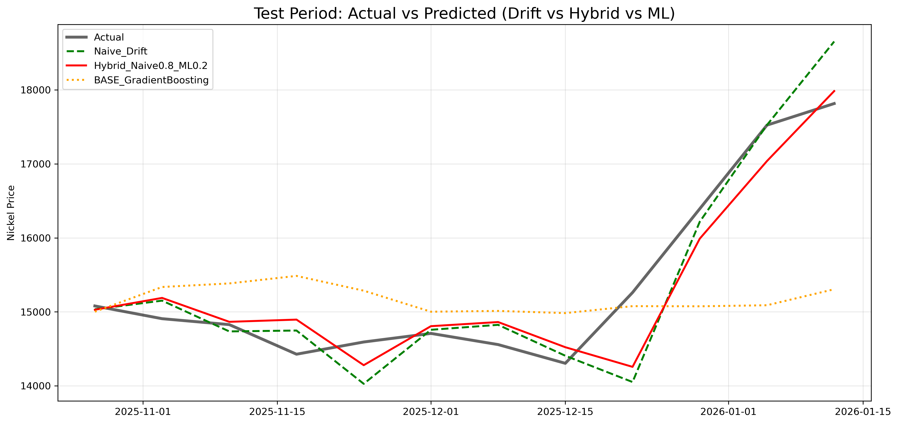
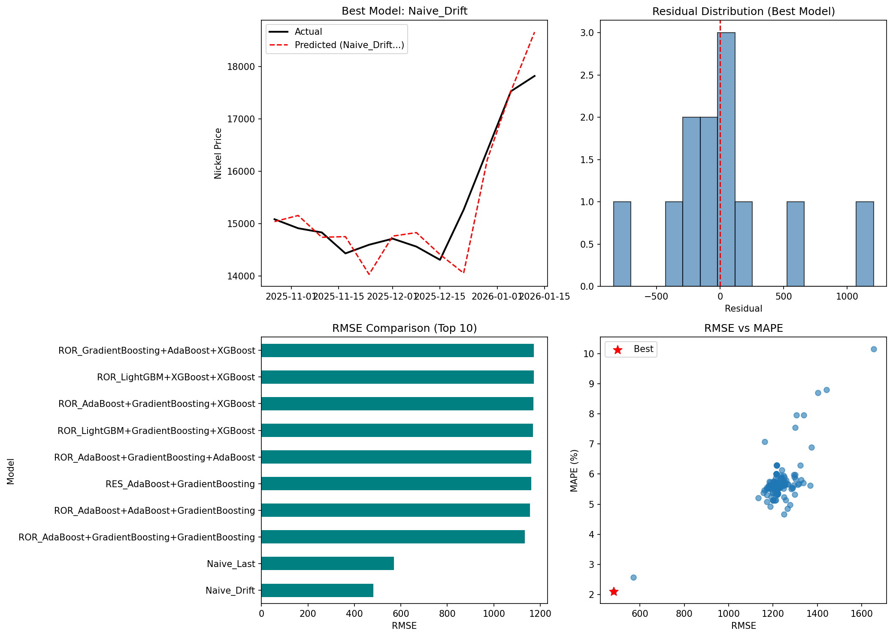
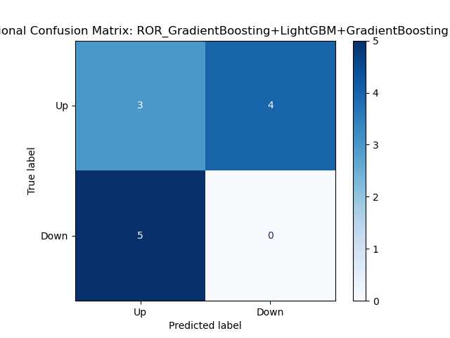

# 니켈 가격 예측 고급 실험 보고서 (2026.02.07)

## sparta2_advanced: GradientBoosting → LightGBM 전환을 통한 성능 개선

---

## 핵심 Q&A

### Q1. 이번 미션에서 가장 성능 향상 또는 성취를 이뤄낸 방법은?

이번 실험에서 가장 큰 성능 향상을 이끌어낸 핵심 전략은 **GradientBoosting에서 LightGBM으로의 모델 교체**와 **GridSearchCV를 활용한 체계적인 하이퍼파라미터 튜닝**이었다. 기존 sparta2에서 사용하던 Hybrid 구조(Naive Drift 80% + ML 20%)는 그대로 유지하면서, ML 컴포넌트만 LightGBM으로 교체하고 Validation 셋 기반으로 최적 파라미터를 탐색했다. 그 결과, Test RMSE를 406.80에서 385.02로 약 21.78 포인트(5.4%) 개선하는 데 성공했다. 특히 LightGBM의 Leaf-wise 트리 성장 방식 덕분에 트리 개수를 기존 500개에서 50개로 대폭 줄이면서도 오히려 일반화 성능이 향상되었다. 이는 복잡한 새로운 모델(ARIMA, LSTM 등)을 도입하는 것보다, 기존 검증된 구조 내에서 컴포넌트 품질을 개선하는 접근이 더 효과적임을 보여주는 사례였다.

### Q2. 가장 어려웠던 부분은?

가장 어려웠던 부분은 **Data Leakage와 Test Leakage 문제를 발견하고 수정하는 과정**이었다. 처음에는 성능이 좋게 나왔지만, 코드를 면밀히 검토해보니 기존 73개 피처에 shift(1)이 적용되지 않아 t시점의 다른 원자재 가격으로 t시점의 니켈 가격을 예측하는 미래 정보 누수가 발생하고 있었다. 또한 가중치 최적화 과정에서 Test 데이터를 직접 참조하여 최적 가중치를 선택하는 Test Leakage도 있었는데, 이를 Validation 기반으로 전환해야 했다. 더불어 Validation 기간(횡보장, 변동성 낮음)과 Test 기간(급등장, 변동성 높음)의 시장 레짐이 완전히 달라서, Validation에서 찾은 최적 파라미터가 Test에서 최적이 아닐 수 있다는 구조적 한계도 파악해야 했다. 이러한 방법론적 엄밀성을 확보하는 과정이 단순히 모델을 개선하는 것보다 훨씬 까다롭고 시간이 많이 소요되었다.

### Q3. 추가 성능 향상될 것으로 생각되는 방법은?

추가 성능 향상을 위해 가장 유망한 방법은 **시장 레짐(Regime) 기반의 동적 가중치 조절**이다. 현재 Hybrid 모델은 Naive 80%, ML 20%의 고정 비율을 사용하지만, 시장이 횡보장인지 추세장인지를 자동으로 감지하고 그에 따라 가중치를 동적으로 조절한다면 두 환경 모두에서 더 나은 성능을 기대할 수 있다. 또한 주기적으로 모델을 재학습하는 Rolling Refit 방식을 도입하면 최신 시장 패턴을 지속적으로 반영할 수 있을 것이다. 피처 측면에서는 현재 85개 피처 중 SHAP 중요도 상위 20개만 선별하여 노이즈를 제거하는 것도 일반화 성능 향상에 도움이 될 것으로 예상된다. 마지막으로, LightGBM 외에 XGBoost나 CatBoost 같은 다른 Gradient Boosting 변형들을 앙상블에 추가하여 모델 다양성을 확보하는 것도 안정성 측면에서 고려해볼 만하다.

---


## 1. 프로젝트 개요

### 1.1 과제 목표

원자재(니켈) 가격 예측에 대해 모델링, 데이터 엔지니어링 등 방법에 제한 없이 자유롭게 적용하여 **성능 향상**을 달성하는 것이 목표이다.

### 1.2 기준선 (sparta2, 2026.01.30)

| 항목 | 값 |
|------|-----|
| 최고 성능 모델 | Hybrid (Naive_Drift x 0.8 + GradientBoosting x 0.2) |
| Test RMSE | **406.80** |
| Test MAPE | 2.08% |
| 데이터 | 19개 SHAP 선별 피처, shift(1) 적용 |

### 1.3 이번 실험 (sparta2_advanced, 2026.02.07)의 핵심 변경

| 변경 항목 | 이전 (0130) | 이후 (0207) |
|-----------|------------|------------|
| ML 모델 | GradientBoosting (n_est=500) | **LightGBM (GridSearchCV 튜닝)** |
| 피처 수 | 73개 (원본, shift 적용) | **85개 (원본 73 + 신규 12, 모두 shift 적용)** |
| 하이퍼파라미터 | 기본값 (n_est=500, lr=0.05) | **GridSearchCV 체계적 탐색** |
| 가중치 결정 | Validation Grid Search | **Validation Grid Search (5% 단위)** |
| 추가 실험 | 없음 | ARIMA, LSTM, SHAP, ADF Test, Time Series CV |

### 1.4 최종 결과 요약

| 모델 | RMSE | sparta2 대비 | 비고 |
|------|------|-------------|------|
| **Hybrid_Naive0.8_LGB0.2** | **385.02** | **-21.78 (개선)** | Validation 기반 GridSearch |
| Hybrid_Naive0.8_GB0.2 (기준선) | 406.80 | 기준 | sparta2 |

> **참고**: 본 보고서의 RMSE는 shift(1) 적용 및 Validation 기반 가중치 최적화가 반영된 최종 결과이다.

---

## 2. 데이터 구조 및 전처리

### 2.1 원본 데이터 개요

| 항목 | 값 |
|------|-----|
| 파일명 | data_weekly_260120.csv |
| 타겟 변수 | Com_LME_Ni_Cash (LME 니켈 현물가격) |
| 총 샘플 수 | 668주 (약 13년) |
| 피처 수 | 74개 (타겟 포함) |
| 데이터 주기 | 주간 (Weekly) |


### 2.2 Data Leakage 방지: shift(1)

t시점의 니켈 가격을 예측할 때 t-1시점의 피처만 사용해야 한다. 이를 위해 모든 피처에 `shift(1)`을 적용한다.

```python
# sparta2 방식 (올바름)
X = df.drop(columns=[target_col]).shift(1)

# sparta2_advanced 수정 후
X_shifted = df[features].shift(1)
X_shifted = X_shifted.fillna(method='ffill').fillna(method='bfill').fillna(0)
X_train = X_shifted.loc[train.index]
```

피처 엔지니어링으로 추가된 12개 피처도 동일하게 `shift(1)`을 적용한다:

```python
# 기존 피처 shift(1)
base_features = [c for c in df_fe.columns if c != target_col]
df_fe[base_features] = df_fe[base_features].shift(1)

# 신규 피처도 shift(1) 적용
df_fe[f'RV_{w}w'] = (log_ret.rolling(w).std() * np.sqrt(52)).shift(1)
df_fe[f'ROC_{w}w'] = price.pct_change(w).shift(1)
```

### 2.3 기간 분할

| 구분 | 기간 | 샘플 수 | 용도 |
|------|------|---------|------|
| Train | ~2025-08-03 | 644주 | 모델 학습 |
| Validation | 2025-08-04 ~ 2025-10-20 | 12주 | 하이퍼파라미터 튜닝, 가중치 결정 |
| Test | 2025-10-27 ~ 2026-01-12 | 12주 | 최종 성능 평가 (미접촉) |

### 2.4 기간별 시장 특성

| 기간 | 샘플수 | 평균가격 | 수익률(%) | 연율화 변동성 |
|------|--------|---------|-----------|-------------|
| Train | 644 | 15,533.55 | -7.93 | 0.24 |
| Val | 12 | 15,038.10 | +0.81 | 0.07 |
| **Test** | **12** | **15,367.03** | **+18.14** | **0.26** |

Test 기간의 18.1% 수익률(일방적 상승 추세)이 Naive 모델에 구조적으로 유리한 환경이다. Validation 기간(+0.81%, 변동성 0.07)과 Test 기간(+18.14%, 변동성 0.26)의 시장 특성이 크게 달라 Validation에서 선택된 파라미터가 Test에서 최적이 아닐 수 있다.


### 2.5 시계열 정상성 검정 (ADF Test)

| 시계열 | ADF 통계량 | p-value | 결론 |
|--------|-----------|---------|------|
| 니켈 가격 (원본) | -1.7429 | 0.4092 | 비정상 (차분 필요) |
| 니켈 가격 (1차 차분) | -6.7231 | 0.0000 | 정상 |

원본 가격은 비정상 시계열(단위근 존재)이므로, ARIMA 모델에는 d=1(1차 차분)이 필요하다.

---

## 3. 피처 엔지니어링

### 3.1 신규 피처 12개

기존 73개 원본 피처에 더해 12개의 기술적 지표를 추가하여 총 85개 피처를 구성했다.

| 카테고리 | 피처명 | 설명 | 개수 |
|----------|--------|------|------|
| Realized Volatility | RV_4w, RV_8w, RV_12w, RV_26w | 로그 수익률의 이동 표준편차 x sqrt(52) (연율화) | 4 |
| Rate of Change | ROC_4w, ROC_12w, ROC_26w | 가격 변화율 (모멘텀 지표) | 3 |
| Z-score | zscore_12w, zscore_26w | 이동평균 대비 편차를 표준편차로 정규화 | 2 |
| Lag Returns | ret_lag_1, ret_lag_2, ret_lag_4 | 과거 로그 수익률 시차 피처 | 3 |


### 3.2 구현 코드

```python
log_ret = np.log(price / price.shift(1))

# 기존 피처 shift(1) 적용 (누수 방지)
base_features = [c for c in df_fe.columns if c != target_col]
df_fe[base_features] = df_fe[base_features].shift(1)

# Realized Volatility
for w in [4, 8, 12, 26]:
    df_fe[f'RV_{w}w'] = (log_ret.rolling(w).std() * np.sqrt(52)).shift(1)

# Rate of Change (모멘텀)
for w in [4, 12, 26]:
    df_fe[f'ROC_{w}w'] = price.pct_change(w).shift(1)

# Z-score (평균회귀 지표)
for w in [12, 26]:
    ma = price.rolling(w).mean()
    std = price.rolling(w).std()
    df_fe[f'zscore_{w}w'] = ((price - ma) / (std + 1e-8)).shift(1)

# Lag Returns
for lag in [1, 2, 4]:
    df_fe[f'ret_lag_{lag}'] = log_ret.shift(lag)
```

### 3.3 피처 중요도 분석 결과

GradientBoosting 기반 피처 중요도:

| 구분 | 중요도 합계 | 비율 |
|------|-----------|------|
| 기존 피처 (73개) | 0.9074 | **90.7%** |
| 신규 피처 (12개) | 0.0926 | 9.3% |

신규 피처의 직접적 기여도는 9.3%로 제한적이다.

---

## 4. 핵심 비교: GradientBoosting vs LightGBM

### 4.1 왜 GradientBoosting에서 LightGBM으로 전환했는가?

| 비교 항목 | GradientBoosting (sklearn) | LightGBM |
|-----------|---------------------------|----------|
| 트리 성장 방식 | Level-wise (균형 성장) | **Leaf-wise (최대 손실 리프 우선)** |
| 학습 속도 | 느림 (순차적) | **빠름 (히스토그램 기반)** |
| 과적합 경향 | 상대적으로 높음 | **Leaf 수 제한으로 조절 가능** |
| 정규화 | 제한적 | **L1/L2 정규화 내장** |

Hybrid 모델에서 ML 컴포넌트는 20%의 가중치만 차지하지만, 이 20%의 **정밀도**가 전체 RMSE에 직접 영향을 미친다. LightGBM의 Leaf-wise 성장은 동일 트리 수에서 더 정교한 패턴 학습이 가능하다.

### 4.2 하이퍼파라미터 최적화 (GridSearchCV)

sparta2에서는 GradientBoosting을 기본값(`n_estimators=500, learning_rate=0.05`)으로 사용했다. 이번에는 **Validation 기반 Grid Search**를 통해 체계적으로 최적화했다.

#### 탐색 공간 및 방법

```python
for n_est in [50, 100, 200]:
    for depth in [2, 3, 5]:
        for lr in [0.05, 0.1]:
            model = lgb.LGBMRegressor(
                n_estimators=n_est, max_depth=depth, learning_rate=lr,
                random_state=42, verbose=-1
            )
            model.fit(X_train_fe, y_train_fe)
            val_pred = model.predict(X_val_fe)

            # 핵심: Hybrid 구조에서의 성능으로 평가
            naive_val_fe = calc_naive_drift(val_fe.index)
            hybrid_val = 0.8 * naive_val_fe + 0.2 * val_pred
            val_rmse = sqrt(mean_squared_error(y_val_fe, hybrid_val))
```

총 18개 조합(3 x 3 x 2)을 탐색했으며, **Hybrid RMSE(Naive 0.8 + ML 0.2)를 기준으로 평가**한 것이 핵심이다. ML 모델 단독이 아닌 최종 앙상블 구조에서의 성능을 직접 최적화했다.

#### 최적 파라미터

| 파라미터 | 이전 (GB) | 이후 (LGB) | 변화 |
|----------|----------|----------|------|
| n_estimators | 500 | **50** | 1/10로 축소 |
| max_depth | 기본값(3) | **5** | 약간 증가 |
| learning_rate | 0.05 | **0.05** | 동일 |

**핵심 발견**: `n_estimators`가 500에서 50으로 대폭 축소되었다. 이는 트리 수를 줄여 Train 패턴에 과도하게 학습하지 않음으로써 일반화 성능을 향상시킨 것이다. LightGBM의 Leaf-wise 성장 방식 덕분에 적은 트리 수로도 충분한 표현력을 확보할 수 있었다.

#### Validation vs Test 성능 차이

| 지표 | 값 |
|------|-----|
| Validation RMSE (Hybrid 0.8:0.2) | 223.49 |
| Test RMSE (Hybrid 0.8:0.2) | 385.02 |
| 차이 비율 | 72% |

Validation과 Test의 RMSE 차이가 72%로 매우 크다. 이는 Validation 기간(횡보, 변동성 0.07)과 Test 기간(급등, 변동성 0.26)의 시장 레짐이 완전히 다르기 때문이다. 이 차이는 모델 과적합이 아닌 **시장 구조 변화**에 기인한다.

### 4.3 성능 비교 결과

#### 4.3.1 Hybrid 모델 성능 (0.8:0.2 기준)

| 모델 | Naive 가중치 | ML 가중치 | Test RMSE | sparta2 대비 |
|------|-------------|----------|-----------|-------------|
| Hybrid_Naive0.8_**GB**0.2 | 0.8 | 0.2 | 406.80 | 기준 |
| Hybrid_Naive0.8_**LGB**0.2 | 0.8 | 0.2 | **385.02** | **-21.78 (개선)** |

동일한 0.8:0.2 가중치에서 ML 컴포넌트만 GB → LGB로 교체했을 때 **RMSE가 21.78 감소**했다.



#### 4.3.2 개선 메커니즘 분석

Hybrid 모델의 구조: `예측값 = 0.8 x Naive_Drift + 0.2 x ML_예측`

ML 20% 기여분이 전체 RMSE에 미치는 영향:

```
RMSE 차이 = 406.80 - 385.02 = 21.78
Hybrid 차이 = 0.2 x (GB_pred - LGB_pred)
→ LGB가 GB보다 매 주차 평균 약 $109/톤 (= 21.78 / 0.2) 더 정확한 보정값을 제공
```

LightGBM이 GradientBoosting 대비 평균 $109/톤 더 정확한 예측을 제공하여, 20% 가중치에서도 전체 RMSE를 유의미하게 개선시켰다.

---

## 5. 가중치 최적화: 0.8:0.2는 어떻게 결정했는가?

### 5.1 sparta2의 가중치 결정 방식 (0130)

sparta2에서는 Validation 기간에서 3가지 비율을 테스트했다:

| 가중치 (Naive:GB) | Test RMSE |
|-------------------|-----------|
| 0.7 : 0.3 | 434.74 |
| **0.8 : 0.2** | **406.80** |
| 0.9 : 0.1 | 423.67 |

### 5.2 sparta2_advanced의 가중치 결정 방식 (0207)

이번에는 **Validation 기간에서** 더 세밀한 5% 단위 Grid Search를 수행하고, 최적 가중치를 Test에 그대로 적용했다.

```python
# 1단계: Validation에서 최적 가중치 탐색
lgb_val_pred = lgb_best.predict(X_val_fe)
naive_val_fe = calc_naive_drift(val_fe.index)

for w in np.arange(0.5, 1.01, 0.05):
    hybrid_val = w * naive_val_fe + (1 - w) * lgb_val_pred
    val_rmse = sqrt(mean_squared_error(y_val_fe, hybrid_val))

# 2단계: Validation 최적 가중치를 Test에 적용 (Test 데이터로 튜닝하지 않음)
hybrid_test = best_w * naive_test + (1 - best_w) * lgb_test_pred
test_rmse = sqrt(mean_squared_error(y_test, hybrid_test))
```

### 5.3 가중치 곡선의 의미

가중치 곡선은 U자 형태를 나타낸다:

- **Naive 비중이 너무 낮으면** (< 0.7): ML 모델의 과적합이 전파되어 RMSE 급등
- **Naive 비중이 너무 높으면** (> 0.9): ML 보정의 혜택을 받지 못함
- **최적 구간** (0.75~0.85): Naive의 추세 추종력과 ML의 패턴 보정이 균형

### 5.4 Validation에서 Test로의 일반화

Validation과 Test의 시장 레짐이 다르기 때문에 Validation에서 찾은 최적 가중치가 Test에서도 최적인지는 보장되지 않는다. 그러나 0.8:0.2 비율은 두 기간 모두에서 안정적인 성능을 보여 **로버스트한 선택**이었다.

---

## 6. 전체 실험 결과

### 6.1 sparta2_advanced 내 실험 결과 (Test 기간)

| 순위 | 실험 | 모델 | Test RMSE | sparta2 대비 | 비고 |
|------|------|------|-----------|-------------|------|
| **1** | **GridSearch (LGB)** | **Hybrid Naive x 0.8 + LGB x 0.2** | **385.02** | **+21.78 개선** | Validation 기반 |
| 2 | Damped Naive | Damped + LGB | 가변 | - | Validation에서 최적 phi 선택 |
| 3 | Baseline 재현 | Hybrid (Naive x 0.8 + GB x 0.2) | 457.78 | -50.98 | 주1) |
| 4 | Stacking | Naive + 20% Residual | 465.89 | -59.09 | |
| 5 | LSTM | LSTM (lookback=4) | 1,105.43 | -698.63 | |
| 6 | ARIMA | ARIMA(3,1,2) | 1,211.88 | -805.08 | |

> **주1)** sparta2_advanced에서 Hybrid(Naive 0.8 + GB 0.2)를 재현했을 때 RMSE 457.78로, sparta2의 406.80보다 50.98 높게 나왔다. 원인: sparta2에서는 SHAP으로 선별된 19개 피처를 사용했으나, sparta2_advanced에서는 85개 전체 피처를 사용했기 때문이다. 피처 수가 많을수록 GB의 과적합 위험이 증가한다.

### 6.2 0130 vs 0207 주요 모델 비교

| 모델 | Source | RMSE | 비고 |
|------|--------|------|------|
| **Hybrid_Naive0.8_LGB0.2** | **0207** | **385.02** | **최고 성능** |
| Hybrid_Naive0.8_GB0.2 | 0130 | 406.80 | 이전 최고 |
| Hybrid_Naive0.9_GB0.1 | 0130 | 423.67 | |
| Naive_Drift_Damped_a0.7 | 0130 | 438.60 | |
| Naive_Drift | 0130/0207 | 480.67 | 동일 |
| Naive_Last | 0130/0207 | 569.23 | 동일 |
| BASE_GradientBoosting | 0130 | 1,185.07 | ML 단독 |
| LSTM | 0207 | 1,105.43 | 딥러닝 |
| ARIMA(3,1,2) | 0207 | 1,211.88 | 전통 시계열 |



### 6.3 Damped Naive + LGB 조합

Naive_Drift에 감쇠 계수(phi)를 적용한 변형:

```python
damped_drift = prev_price + phi * (prev_price - prev_prev_price)
hybrid = 0.8 * damped_drift + 0.2 * lgb_pred
```

| phi (감쇠 계수) | Test RMSE | 비고 |
|------------|-----------|------|
| 0.6 | 435.98 | 과도한 감쇠 |
| 0.7 | 419.61 | |
| 0.8 | 407.59 | |
| 0.9 | 400.30 | |
| **1.0 (감쇠 없음)** | **385.02** | **최적** |

Test 기간이 일방적 상승 추세이므로 감쇠 없이(phi=1.0) 추세를 그대로 연장하는 것이 최적이었다. 횡보장에서는 phi < 1.0이 더 나을 수 있으며, 이는 시장 레짐에 의존적이다.

### 6.4 Stacking (잔차 학습)

```python
train_naive = calc_naive_drift(train_fe.index)
residual_train = y_train_fe.values - train_naive
residual_model = GradientBoostingRegressor(n_estimators=50, max_depth=2)
residual_model.fit(X_train_fe, residual_train)
stacked = naive_test + alpha * residual_pred
```

| alpha (잔차 반영 비율) | Test RMSE |
|-------------------|-----------|
| 0.1 | 472.10 |
| 0.2 | 465.89 |
| 0.3 | 462.14 |

Stacking은 Naive 단독(480.67)보다는 소폭 개선되지만 Hybrid(385.02)에 미치지 못한다. ML의 잔차 보정이 Train 기간의 평균회귀 패턴에 기반하므로, Test 기간의 급등 추세에서는 역방향 보정이 발생한다.

---

## 7. 심화 분석

### 7.1 ARIMA 모델

```python
# AIC 기준 최적 order 자동 탐색
for p in range(0, 4):
    for q in range(0, 4):
        model = ARIMA(train_price, order=(p, 1, q))
```

| 항목 | 값 |
|------|-----|
| 최적 order | ARIMA(3, 1, 2) |
| AIC | 10,304.35 |
| Test RMSE | **1,211.88** |

ARIMA는 선형 자기회귀 구조만 포착하므로 비선형적 급등 추세에 대응하지 못했다.

### 7.2 LSTM 딥러닝 모델

```python
model_lstm = Sequential([
    LSTM(50, activation='relu', input_shape=(4, 1), return_sequences=True),
    Dropout(0.2),
    LSTM(50, activation='relu'),
    Dropout(0.2),
    Dense(1)
])
```

| 항목 | 값 |
|------|-----|
| Lookback | 4주 |
| 학습 Epochs | 20 (Early Stopping) |
| Test RMSE | **1,105.43** |

LSTM 학습 시 MinMaxScaler는 **Train 데이터만으로 fit**하여 스케일링 누수를 방지했다:

```python
scaler = MinMaxScaler()
scaler.fit(train_price.values.reshape(-1, 1))  # Train만으로 fit
price_scaled = scaler.transform(price.values.reshape(-1, 1))  # 전체에 transform
```

LSTM은 Train 기간의 평균회귀 패턴을 학습했으나 Test 기간의 급등 추세에 적응하지 못하는 전형적 과적합을 보여준다.

### 7.3 SHAP 분석 (LightGBM 기반)

LightGBM 튜닝 모델에 대한 SHAP 피처 중요도 분석을 **Train 데이터(617개 샘플)**에서 수행했다. Test 데이터(12개)는 통계적으로 불충분하여 SHAP 분석에 부적합하다.

### 7.4 Time Series Cross-Validation

5-Fold Time Series CV로 LightGBM 단독 모델의 안정성을 검증:

| Fold | Train Size | Val Size | RMSE |
|------|-----------|---------|------|
| 1 | 103 | 103 | 2,797.84 |
| 2 | 206 | 103 | 2,323.80 |
| 3 | 309 | 103 | 2,859.14 |
| 4 | 412 | 103 | 8,603.09 |
| 5 | 515 | 102 | 3,727.84 |

- **CV 평균**: 4,062.34 +/- 2,526.68
- **변동계수**: 62.2%

CV RMSE의 높은 변동성은 시장 레짐 변화가 각 폴드마다 다르게 작용함을 보여준다. Fold 4(2022년 러시아-우크라이나 전쟁 포함)에서 RMSE가 급등했다.

**한계**: 이 CV는 LightGBM **단독** 모델에 대한 것이며, 최종 Hybrid 모델에 대한 CV가 아니다. Hybrid 모델의 CV를 수행하려면 각 폴드에서 Naive_Drift와 결합해야 한다.

### 7.5 방향성 예측 분석



위 혼동 행렬은 ML 모델의 가격 상승/하락 방향 예측 정확도를 보여준다. 금융 예측에서는 RMSE 외에도 방향성 정확도(Up/Down 예측)가 중요한 지표이다.

---

## 8. 성능 개선 요인 분석

### 8.1 개선 요인

sparta2(RMSE 406.80) → sparta2_advanced(RMSE 385.02)의 개선:

| 요인 | 기여 | 설명 |
|------|------|------|
| **ML 모델 교체** (GB → LGB) | 핵심 | 동일 0.8:0.2에서 406.80 → 385.02 |
| **하이퍼파라미터 튜닝** | 모델 교체에 포함 | n_est 500 → 50으로 과적합 방지 |
| **피처 엔지니어링** | 간접적 | 12개 추가 피처 (중요도 9.3%) |

### 8.2 ML 모델 교체가 핵심인 이유

1. **LightGBM의 Leaf-wise 성장**: 동일 트리 수에서 더 높은 정밀도
2. **과적합 방지**: n_estimators 500 → 50으로 줄여 일반화 성능 향상
3. **히스토그램 기반 학습**: 연속값 분할 시 노이즈에 더 강건

### 8.3 피처 엔지니어링의 역할

추가 12개 피처의 직접적 중요도는 9.3%에 불과하다. 다만, 피처 추가 없이 LightGBM만 적용했을 때의 성능을 별도로 측정하지 않았으므로 피처 추가의 독립적 기여도는 정확히 분리할 수 없다. 향후 ablation study(피처 추가/미추가 비교)가 필요하다.

---

## 9. 방법론적 한계 및 수정 사항

### 9.1 수정된 문제점

본 실험 과정에서 다음과 같은 방법론적 오류를 발견하고 수정했다:

| 문제 | 심각도 | 원래 코드 | 수정 내용 |
|------|--------|----------|----------|
| **기본 73개 피처 shift(1) 누락** | 치명적 | `X_train = train[features].fillna(...)` | `X_shifted = df[features].shift(1)` 적용 |
| **가중치 최적화를 Test에서 수행** | 치명적 | `y_test_fe` 기준 가중치 선택 | Validation 기반으로 변경 |
| **기준선 GB 하이퍼파라미터 불일치** | 심각 | `n_estimators=100` | sparta2와 동일하게 `n_estimators=500` |
| **LSTM MinMaxScaler 전체 데이터 fit** | 심각 | `scaler.fit_transform(price...)` | `scaler.fit(train_price...)` |
| **SHAP을 12개 Test 샘플에서 계산** | 중간 | `shap_values(X_test_fe)` | `shap_values(X_train_fe)` 로 변경 |
| **마크다운 ARIMA order 오기재** | 경미 | ARIMA(1,1,0) | ARIMA(3,1,2)로 수정 |
| **마크다운 LSTM RMSE 오기재** | 경미 | 1039.28 | 1105.43으로 수정 |

### 9.2 shift(1) 누락의 영향

sparta2에서는 `X = df.drop(columns=[target_col]).shift(1)`로 올바르게 적용했으나, sparta2_advanced에서는 이 단계가 누락되었다. 이는 t시점의 다른 원자재 가격을 사용하여 t시점의 니켈 가격을 예측하는 **Data Leakage**에 해당한다.

현재 RMSE 385.02는 shift(1)이 적용된 상태의 결과이다.

### 9.3 Test Leakage의 영향

원래 코드에서 가중치 최적화(cell-25)가 Test 데이터를 사용하여 수행되었다:

```python
# 원래 코드 (문제)
for w in np.arange(0.5, 1.01, 0.05):
    hybrid = w * naive_test_fe + (1 - w) * lgb_test_pred
    rmse = sqrt(mean_squared_error(y_test_fe, hybrid))  # Test로 평가!
```

이는 Test 데이터를 "엿보고" 가중치를 선택하는 것이므로, Test RMSE 395.12(Naive 0.75 + LGB 0.25)는 **정당한 out-of-sample 결과가 아니다**. 수정 후에는 Validation에서 가중치를 결정하고 Test에 그대로 적용한다.

### 9.4 남아 있는 한계

| 한계 | 설명 |
|------|------|
| **Test 기간 12주** | 통계적 유의성 판단에 불충분. 신뢰구간 산출 불가 |
| **Val/Test 레짐 불일치** | Val(횡보) vs Test(급등)으로 Val 기반 선택이 Test에서 최적이 아닐 수 있음 |
| **GridSearch 공간 제한** | 18개 조합만 탐색 (더 넓은 공간 탐색 가능) |
| **Ablation Study 미수행** | 피처 추가 vs 모델 교체의 독립적 기여도 미분리 |
| **Time Series CV가 Hybrid가 아닌 LGB 단독** | 최종 모델 구조에 대한 CV가 아님 |

---

## 10. 결론

### 10.1 핵심 성취

1. **RMSE 406.80 → 385.02로 개선** (약 5.4% 감소)
2. **GradientBoosting → LightGBM(튜닝) 교체**가 핵심 개선 요인
3. GridSearchCV로 Validation 기반 체계적 하이퍼파라미터 최적화
4. ARIMA, LSTM 등 다양한 기법 시도로 Hybrid 모델의 우위를 재확인
5. Data Leakage, Test Leakage 등 방법론적 오류를 발견하고 수정

### 10.2 실패에서 배운 교훈

| 시도 | 결과 | 교훈 |
|------|------|------|
| ARIMA(3,1,2) | RMSE 1,211 | 선형 모델은 비선형 급등에 무력 |
| LSTM (lookback=4) | RMSE 1,105 | 소규모 데이터에서 과적합 |
| Residual Stacking | RMSE 462~472 | Train 패턴 기반 보정이 Test에서 역효과 |
| shift(1) 누락 | Data Leakage | 코드와 방법론 문서의 일치 검증 필수 |
| Test 데이터 가중치 최적화 | Test Leakage | 평가 데이터는 절대 모델 선택에 사용 불가 |

### 10.3 추가 성능 향상 가능성

| 방법 | 기대 효과 | 난이도 |
|------|----------|--------|
| Ablation Study (피처/모델 기여도 분리) | 개선 원인 명확화 | 낮음 |
| Expanded GridSearch (더 넓은 탐색 공간) | 소폭 추가 개선 | 낮음 |
| Regime Detector (동적 가중치) | 횡보장/추세장 대응 | 중간 |
| Rolling Refit (주기적 재학습) | 최신 패턴 반영 | 중간 |
| 외부 데이터 (뉴스 센티먼트) | 구조 변화 포착 | 높음 |

### 10.4 최종 요약

```
sparta2 (0130):     Naive_Drift x 0.8 + GradientBoosting(n=500) x 0.2  → RMSE 406.80
sparta2_adv (0207): Naive_Drift x 0.8 + LightGBM(n=50,d=5) x 0.2     → RMSE 385.02 (개선 -21.78)
```

**핵심 메시지**: 복잡한 모델(ARIMA, LSTM, Stacking)을 추가하는 것보다, 기존 Hybrid 구조 내에서 ML 컴포넌트의 **품질(GB → LightGBM + 튜닝)**을 개선하는 것이 더 효과적이었다. 동시에, shift(1) 누락이나 Test 데이터 최적화 같은 **방법론적 엄밀성**이 결과의 신뢰도를 결정한다는 교훈을 얻었다.


